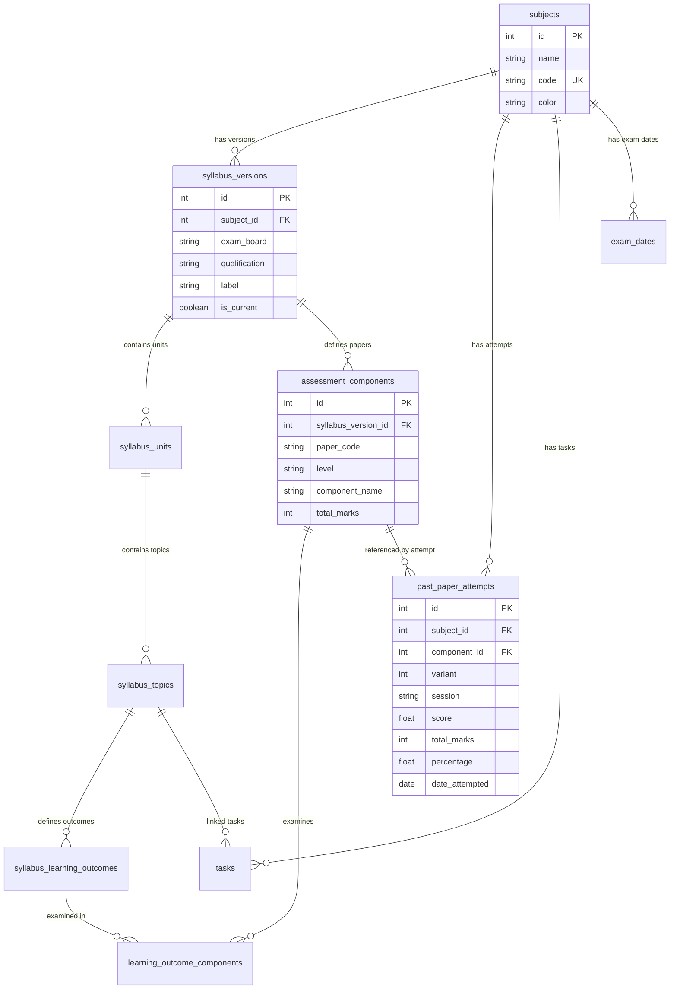

Checkpoint ID: 2026-07-30_2314
Generated At: 2026-07-30 23:14
Document Type: Architecture
Repository Branch: main
Commit SHA: bc3f90f9d58c3ff0397dc3641bcb79494fe13bd3
Scope: Technical Architecture Documentation Snapshot post Phase 1 Reference Data Verification
Status: Repository Snapshot

# Technical Architecture

## Application Architecture

Lockdin uses a monorepo architecture managed with `pnpm` workspaces. Application code is organized into reusable internal libraries (`lib/`), independent runnable applications/services (`artifacts/`), administrative/data scripts (`scripts/`), and Supabase local stack configuration (`supabase/`).

```mermaid
flowchart TD
    subgraph Client Layer
        RP["Revision Platform (Vite + React 19)<br/>artifacts/revision-platform"]
        MS["Mockup Sandbox (Vite + React 19)<br/>artifacts/mockup-sandbox"]
    end

    subgraph API & Backend Layer
        API["Express API Server (:3001)<br/>artifacts/api-server"]
    end

    subgraph Core Shared Libraries
        DB_LIB["Database Package (@workspace/db)<br/>lib/db"]
        ZOD_LIB["Zod Schemas (@workspace/api-zod)<br/>lib/api-zod"]
        SPEC_LIB["OpenAPI Spec (@workspace/api-spec)<br/>lib/api-spec"]
    end

    subgraph Data & Infra
        SUPA["Supabase Postgres DB<br/>Session Pooler (*.pooler.supabase.com:5432)"]
        CLI["Syllabus CLI Importer<br/>scripts/src/syllabus"]
    end

    RP -->|REST API / JSON| API
    MS -->|REST API / JSON| API
    API -->|Import Schema| DB_LIB
    API -->|Validate Input| ZOD_LIB
    DB_LIB -->|pg Pool (max: 1)| SUPA
    CLI -->|Upsert Data| DB_LIB
```

---

## Repository Structure

```text
lockdinapp/
├── artifacts/                      # User-facing applications and services
│   ├── api-server/                 # Express REST API server (/api routes)
│   ├── mockup-sandbox/             # Prototype / component sandbox UI
│   └── revision-platform/          # Primary React 19 + Vite student frontend
├── lib/                            # Shared workspace libraries
│   ├── api-client-react/           # React hooks for API interaction
│   ├── api-spec/                   # OpenAPI / Swagger specification
│   ├── api-zod/                    # Shared Zod validation schemas
│   └── db/                         # Drizzle ORM schemas & postgres connection
│       ├── drizzle.config.ts       # Drizzle kit configuration
│       ├── migrations/             # Migration SQL & Drizzle journal
│       └── src/
│           ├── index.ts            # pg.Pool exporter (max: 1 connection)
│           └── schema/             # Drizzle table schemas (11 tables)
├── scripts/                        # Ingestion & maintenance scripts
│   ├── preinstall.mjs              # Cross-platform preinstall check
│   └── src/syllabus/               # Syllabus CSV parser, validator & importer
├── supabase/                       # Supabase CLI setup & configuration
│   └── config.toml                 # Local Supabase stack & auth config
├── data/                           # Repository reference data
│   └── syllabi/raw/                # 9 validated Cambridge A-Level CSVs
└── docs/                           # Documentation root
    ├── README.md                   # Permanent documentation index
    ├── lockdin-architecture-plan.md# Phased development roadmap
    ├── supabase-local-setup.md     # Supabase setup guide
    └── checkpoints/                # Historical timestamped checkpoints
```

---

## Authentication Architecture

- **Current State:** Frontend uses a lightweight mock authentication model stored in `localStorage`. The current database schema does not enforce user authentication or session validation on table operations.
- **Supabase Auth Integration (Planned for Phase 2):**
  - Supabase Auth will serve as the single authority for user authentication (Email/Password & OAuth).
  - Auth config is prepared in `supabase/config.toml` with `site_url = "http://localhost:5000"` and standard redirect URIs.
  - JWT tokens issued by Supabase Auth will be passed in the `Authorization: Bearer <token>` HTTP header to the Express API server.
  - Express middleware will extract `auth.uid()` from verified JWTs and inject user identity into request context.

---

## Database Architecture

The database is built on PostgreSQL hosted via Supabase and managed using Drizzle ORM (`drizzle-orm` `^0.45.2`).

### 1. Shared Reference Data Tables (Syllabus Architecture)

Shared reference data stores canonical Cambridge A-Level curriculum specifications. Content hangs off a specific `syllabus_versions` entry rather than directly off a `subjects` row, ensuring syllabus updates do not alter existing student progress links.

```text
subjects (1) ───< syllabus_versions (1) ───< syllabus_units (1) ───< syllabus_topics (1) ───< syllabus_learning_outcomes (M)
    │                     │                                                                                   │
    │                     └───< assessment_components (1) ───────────────────────────────────────────────────┤
    │                                    │                                                                    │
    └───────────────────< past_paper_attempts (M)                     learning_outcome_components (M) ────────┘
```

- **`subjects`**: Core subject identity (`id`, `name`, `code`, `color`). Unique on `code`.
- **`syllabus_versions`**: Specific syllabus specification (`id`, `subject_id`, `exam_board`, `qualification`, `label`, `valid_from`, `valid_to`, `is_current`, `source_file`).
- **`syllabus_units`**: Top-level Main Topics (`id`, `subject_id`, `syllabus_version_id`, `title`, `order_index`).
- **`syllabus_topics`**: Subtopics under a unit (`id`, `unit_id`, `subject_id`, `title`, `status`, `notes`, `order_index`).
- **`syllabus_learning_outcomes`**: Individual learning outcome text (`id`, `topic_id`, `outcome`, `order_index`).
- **`assessment_components`**: Level-aware exam papers (`id`, `syllabus_version_id`, `paper_code`, `level`, `component_name`, `duration_minutes`, `total_marks`, `weighting_percent`, `order_index`). Unique natural key: `(syllabus_version_id, paper_code, level)`.
- **`learning_outcome_components`**: Many-to-many junction linking learning outcomes to exam papers (`id`, `learning_outcome_id`, `component_id`, `level`).

### 2. User-Owned / Operational Tables

- **`tasks`**: Actionable student tasks (`id`, `title`, `subject_id`, `topic_id`, `deadline`, `priority`, `estimated_minutes`, `completed`, `completed_at`, `created_at`).
- **`past_paper_attempts`**: Atomized past paper attempt log (`id`, `subject_id`, `component_id`, `variant`, `session`, `score`, `total_marks`, `percentage`, `date_attempted`, `time_taken_minutes`, `notes`).
- **`exam_dates`**: Scheduled exam calendar entries (`id`, `subject_id`, `paper_code`, `date`, `notes`).

---

## Entity Relationship Diagram (ERD)



---

## Data Ownership Model

1. **Shared Canonical Reference Layer:**
   - Managed strictly via database migrations and administrative CLI tools (`syllabus:import`).
   - Immutable to regular users.
   - Includes `subjects`, `syllabus_versions`, `syllabus_units`, `syllabus_topics`, `syllabus_learning_outcomes`, `assessment_components`, and `learning_outcome_components`.

2. **Per-User Operational Layer (Phase 2 & Phase 3 Target):**
   - User data will isolate all state using `user_id` foreign keys bound to `auth.users.id`.
   - Includes `tasks`, `past_paper_attempts`, `user_subjects`, `topic_progress`, and `exam_dates`.

---

## Security Architecture

- **Row Level Security (RLS):** RLS is currently inactive on Supabase tables. Security policies will be applied during Phase 2 (`tasks`) and Phase 3 (`past_paper_attempts`, `user_subjects`).
- **Connection Security:** `DATABASE_URL` is kept in server-side environment variables (`.env.local`) and is never bundled or exposed to frontend React client code.
- **Serverless Resilience:** Database connection pool is capped at `max: 1` per isolate with `allowExitOnIdle: true` to prevent connection exhaustion over Supabase Session Pooler.

---

## Past-Paper Architecture

The past-paper logging system atomizes paper identity into discrete relational fields rather than storing unparsed paper code strings.

### 1. Relational Representation
- **`subject_id`**: Foreign key to `subjectsTable.id` (e.g. 9702 Physics).
- **`component_id`**: Foreign key to `assessmentComponentsTable.id` (points to component paper, e.g. Paper 4 A Level Structured Questions).
- **`variant`**: Integer between 1 and 5 representing exam variant (e.g. `2`).
- **`session`**: Enum restricted to `["May/June", "Oct/Nov", "Feb/Mar", "Specimen"]`.

### 2. Display Code Generation
Display codes like `"9702/42"` are derived dynamically at query/render time:
```text
Display Code = ${subject.code} / ${component.paperCode}${variant ?? ''}
```
*Example:* Subject code `9702`, component paper code `4`, variant `2` produces display code `9702/42`.
The stored representation preserves relational foreign keys for component total marks, weighting, and syllabus version context.
