Checkpoint ID: 2026-07-30_2314
Generated At: 2026-07-30 23:14
Document Type: Data Pipeline
Repository Branch: main
Commit SHA: bc3f90f9d58c3ff0397dc3641bcb79494fe13bd3
Scope: Reference Data Ingestion Architecture & Pipeline Documentation Snapshot
Status: Repository Snapshot

# Data Pipeline Architecture

## Ingestion Architecture Flow

The reference data pipeline ingests Cambridge International A-Level syllabus CSV specifications into normalized PostgreSQL tables.

```mermaid
flowchart LR
    CSV["Source CSV Files<br/>data/syllabi/raw/*.csv"]
    VAL["Validator Engine<br/>scripts/src/syllabus/parse-csv.ts"]
    NORM["Normalizer Engine<br/>scripts/src/syllabus/normalize.ts"]
    UPSERT["DB Upsert Handler<br/>scripts/src/syllabus/db-upsert.ts"]
    DB[("Supabase Postgres DB")]
    API["Express API Server<br/>/api/subjects"]
    UI["Revision Platform UI"]

    CSV -->|Read 12 Columns| VAL
    VAL -->|Validated Rows| NORM
    NORM -->|Hierarchy Tree| UPSERT
    UPSERT -->|Transaction Upsert| DB
    DB -->|Drizzle Queries| API
    API -->|JSON Endpoint| UI
```



---

## Source Data

- **Location:** `data/syllabi/raw/`
- **File Naming Convention:** `<subject_code>_<subject_slug>.csv`
- **Validated CSV Files (9 Total):**
  1. `9231_further_mathematics.csv` (52,080 bytes)
  2. `9489_history.csv` (225,816 bytes)
  3. `9609_business.csv` (208,027 bytes)
  4. `9618_computer_science.csv` (106,525 bytes)
  5. `9700_biology.csv` (312,401 bytes)
  6. `9701_chemistry.csv` (232,283 bytes)
  7. `9702_physics.csv` (158,791 bytes)
  8. `9708_economics.csv` (152,034 bytes)
  9. `9709_mathematics.csv` (71,688 bytes)
- **Audit Artifact:** `data/syllabi/raw/_audit_report.json` containing detailed validation checks and metrics.

---

## CSV Schema

The parser expects 12 strict headers in every syllabus CSV file:

1. `Main Topic` (string): Top-level syllabus unit title.
2. `Subtopic` (string): Specific subtopic title under the unit.
3. `Learning Outcome` (string): Text description of the learning outcome.
4. `Subject` (string): Canonical subject name (e.g. "Physics").
5. `Exam Board` (string): Examining body (e.g. "CIE").
6. `Qualification` (string): Qualification tier (e.g. "A Level").
7. `Level` (string): Component level (e.g. "AS Level", "A Level", or "AS/A Level").
8. `Component Name` (string): Formal paper title (e.g. "Paper 1 Multiple Choice").
9. `Paper Code` (string): Component number identifier (e.g. "1", "4").
10. `Duration (min)` (integer / string): Exam duration in minutes.
11. `Total Marks` (integer / string): Total score available on the paper.
12. `Weighting (%)` (real / string): Percentage contribution to qualification grade.

---

## CSV → Database Mapping

| CSV Column | Target Table | Target Column | Transformation / Logic |
| --- | --- | --- | --- |
| `Subject` | `subjects` | `name` | Extracted; mapped to standard code via `manifest.ts`. Unique on `code`. |
| — | `subjects` | `code` | Derived from manifest file mapping (e.g. `"9702"`). |
| — | `subjects` | `color` | Assigned standard subject color token from manifest. |
| `Exam Board` | `syllabus_versions` | `exam_board` | Preserved directly. |
| `Qualification` | `syllabus_versions` | `qualification` | Preserved directly. |
| — | `syllabus_versions` | `source_file` | Source filename (e.g. `"9702_physics.csv"`). |
| `Main Topic` | `syllabus_units` | `title` | Grouped; unique natural key `(syllabus_version_id, title)`. |
| `Subtopic` | `syllabus_topics` | `title` | Grouped under unit; unique natural key `(unit_id, title)`. |
| `Learning Outcome` | `syllabus_learning_outcomes` | `outcome` | Normalized per subtopic; unique key `(topic_id, outcome)`. |
| `Paper Code` | `assessment_components` | `paper_code` | Extracted string (e.g. `"1"`). |
| `Level` | `assessment_components` | `level` | Preserved per component; unique key `(version_id, paper_code, level)`. |
| `Component Name` | `assessment_components` | `component_name` | Preserved directly. |
| `Duration (min)` | `assessment_components` | `duration_minutes` | Parsed integer (nullable if unstated). |
| `Total Marks` | `assessment_components` | `total_marks` | Parsed integer (nullable if unstated). |
| `Weighting (%)` | `assessment_components` | `weighting_percent` | Parsed float (nullable if unstated). |
| — | `learning_outcome_components` | `learning_outcome_id` | Foreign key referencing `syllabus_learning_outcomes.id`. |
| — | `learning_outcome_components` | `component_id` | Foreign key referencing `assessment_components.id` (nullable for general outcomes). |
| `Level` | `learning_outcome_components` | `level` | Preserved level string. |

---

## Import Process

The import pipeline is operated using `pnpm` workspace scripts located in `scripts/`:

### 1. Syllabus Validation
Run CSV structural and semantic validation across all configured files:
```bash
cmd /c pnpm --filter @workspace/scripts syllabus:validate
```
*Output Verification:* Checks 9/9 CSV files against schema constraints, verifying zero header mismatches, missing required values, or invalid number formats.

### 2. Dry-Run Import
Simulate complete normalization and database transaction execution without committing changes:
```bash
cmd /c pnpm --filter @workspace/scripts syllabus:import --mode=import --dry-run
```
*Output Verification:* Traces code paths through `db-upsert.ts`, verifying that the transaction is rolled back cleanly and 0 database writes occur.

### 3. Live Database Import
Execute the live pipeline against Supabase Postgres:
```bash
cmd /c pnpm --filter @workspace/scripts syllabus:import
```

---

## Import Safety & Idempotency

- **Atomic Transactions:** Each syllabus version import executes inside a single PostgreSQL transaction (`db.transaction(...)`). Any error during execution triggers an immediate rollback.
- **Idempotency Guarantees:**
  - `subjects`: Upserted using `ON CONFLICT (code) DO UPDATE`.
  - `syllabus_versions`: Upserted using `ON CONFLICT (subject_id, source_file) DO UPDATE`.
  - `syllabus_units`: Upserted using `ON CONFLICT (syllabus_version_id, title) DO UPDATE`.
  - `syllabus_topics`: Upserted using `ON CONFLICT (unit_id, title) DO UPDATE`. Preserves user progress fields (`status`, `notes`) on conflict.
  - `syllabus_learning_outcomes`: Upserted using `ON CONFLICT (topic_id, outcome) DO UPDATE`.
  - `assessment_components`: Upserted using `ON CONFLICT (syllabus_version_id, paper_code, level) DO UPDATE`.
- **Relationship Handling:** `learning_outcome_components` junction entries for a version are deleted and re-inserted inside the transaction. Re-running the import against a populated database results in identical total row counts (4,817 rows).

---

## Runtime Data Flow

1. **Database Querying:** Express API endpoints (`artifacts/api-server/src/routes/subjects.ts`) query `subjectsTable` and join aggregate counts from `syllabusUnitsTable` and `syllabusTopicsTable`.
2. **REST API Endpoint:** `GET /api/subjects` returns structured JSON:
```json
[
  {
    "id": 1,
    "name": "Further Mathematics",
    "code": "9231",
    "color": "#3B82F6",
    "topicsTotal": 24
  },
  {
    "id": 7,
    "name": "Physics",
    "code": "9702",
    "color": "#8B5CF6",
    "topicsTotal": 81
  }
]
```
3. **Client UI Consumption:** Frontend React components fetch live subject metadata via TanStack Query and render interactive subject cards and syllabus progression views.
