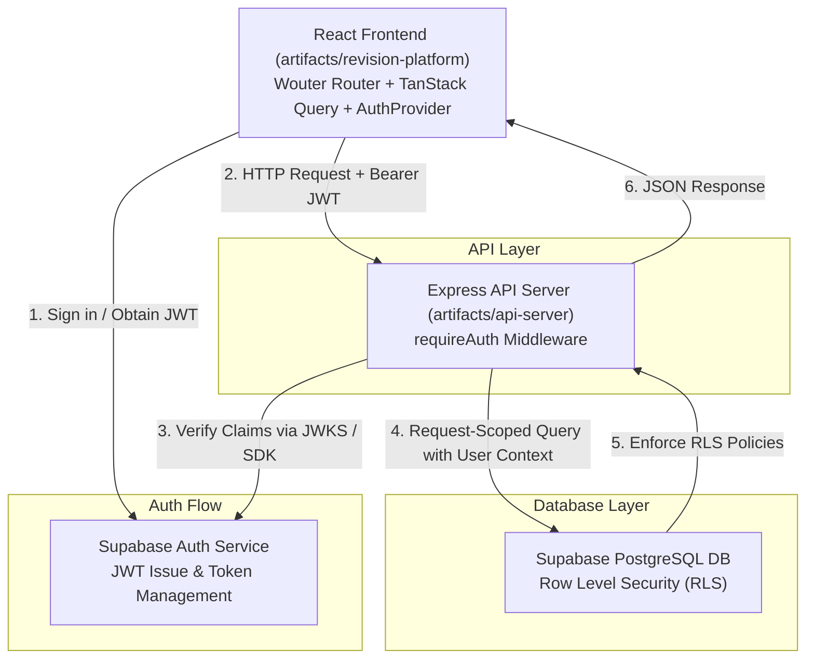
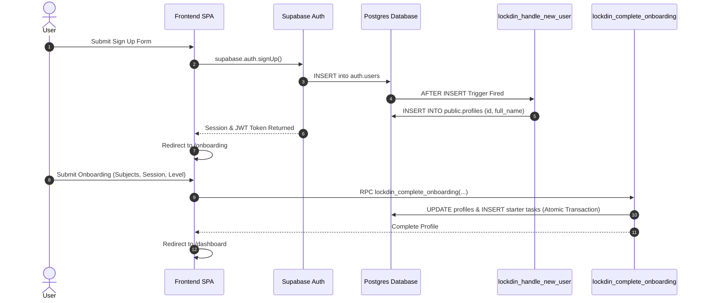
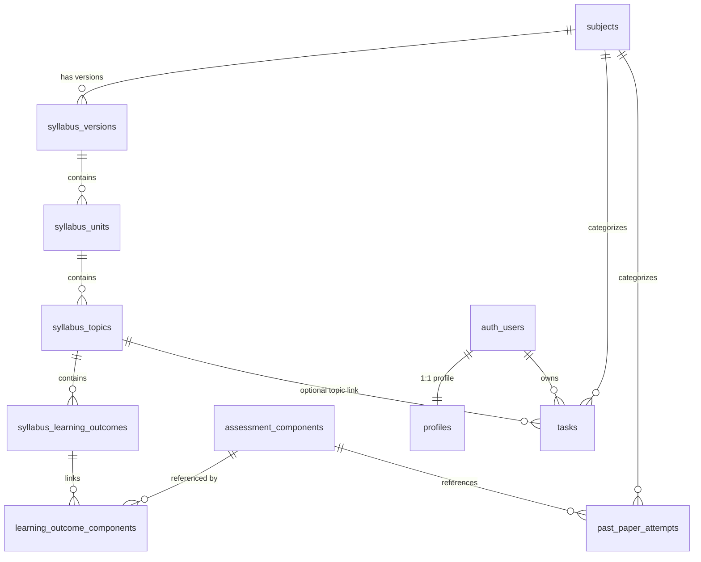

Checkpoint ID: 2026-08-07_1118
Generated At: 2026-08-07 11:18
Document Type: Architecture Documentation
Repository Branch: main
Commit SHA: 7d7cedb1f2faff2f78cf32231fa36aa51b996d4c
Scope: Technical Architecture Documentation post Phase 2 Closeout
Status: Repository Snapshot

# Technical Architecture

This document presents the verified system architecture, repository layout, data ownership model, security controls, and domain models for Lockdin.

---

## Application Architecture

The system follows a modern decoupled web architecture with client-side React rendering, an Express API gateway, and hosted Supabase PostgreSQL backend services.



### Component Interaction Overview

1. **Frontend Platform (`artifacts/revision-platform`):**
   - Single-Page Application (SPA) built with React 19, Vite 7, and Wouter.
   - Manages authentication state using `AuthProvider` and `@supabase/supabase-js`.
   - Protects client routes using `RequireAuth` (for authenticated pages) and `RedirectIfAuthenticated` (for public auth pages).
   - Sends JWT Access Tokens in the `Authorization: Bearer <token>` header for backend API requests.

2. **API Server (`artifacts/api-server`):**
   - Node.js / Express server mounted under `/api`.
   - Uses custom `requireAuth` middleware to intercept protected requests:
     - Extracts JWT Bearer token from request headers.
     - Verifies token claims via `getSupabaseVerifier().auth.getClaims(token)`.
     - Validates `sub` UUID claim.
     - Attaches `req.userId` and `req.accessToken` to the request context.
   - Instantiates request-scoped Supabase client initialized with caller's access token, preserving user context down to PostgreSQL.

3. **Database Layer (`lib/db` & Supabase Postgres):**
   - PostgreSQL hosted on Supabase.
   - Evaluates PostgreSQL Row Level Security (RLS) policies on every query.
   - Enforces user isolation (`auth.uid() = user_id`) at the database engine level.

---

## Repository Structure

The codebase is organized as a `pnpm` monorepo workspace.

```text
lockdinapp/
├── artifacts/
│   ├── api-server/              # Express API server & routes
│   │   ├── src/
│   │   │   ├── express-app.ts   # Express server initialization
│   │   │   ├── lib/             # Supabase verifier & error handlers
│   │   │   ├── middlewares/     # requireAuth JWT verification
│   │   │   └── routes/          # API route definitions
│   │   ├── build.mjs            # Production esbuild script
│   │   └── package.json
│   ├── mockup-sandbox/          # Secondary UI sandbox component showcase
│   └── revision-platform/       # Primary React + Vite SPA
│       ├── src/
│       │   ├── components/      # UI components (AuthProvider, RequireAuth, etc.)
│       │   ├── hooks/           # Custom React hooks
│       │   ├── lib/             # API client, auth utils, query clients
│       │   ├── pages/           # Application views (dashboard, subjects, etc.)
│       │   └── App.tsx          # Root app & route definitions
│       └── package.json
├── data/
│   └── syllabi/
│       └── raw/                 # 9 validated Cambridge A-Level CSV files
├── docs/                        # Architecture, reports, and checkpoint snapshots
│   ├── README.md                # Permanent rolling index
│   └── checkpoints/             # Historical immutable checkpoints
├── lib/
│   └── db/                      # Database package
│       ├── migrations/          # SQL migrations (0000 to 0003)
│       ├── src/
│       │   ├── index.ts         # Database connection pool (max: 1)
│       │   └── schema/          # Drizzle schema definitions
│       └── drizzle.config.ts
├── scripts/                     # Ingestion & maintenance CLI tools
│   └── src/syllabus/            # CSV parser, validator, and importer
├── supabase/
│   └── config.toml              # Local Supabase CLI configuration
├── package.json                 # Root package script runner
└── pnpm-workspace.yaml          # Monorepo workspace configuration
```

---

## Authentication Architecture

Authentication is powered by Supabase Auth with custom database lifecycle hooks.



### Key Auth Design Decisions

1. **Trigger-Based Profile Creation:** Profile row is created automatically in `public.profiles` when `auth.users` receives a new row. Blank metadata is normalized to `NULL`.
2. **Atomic Onboarding RPC (`lockdin_complete_onboarding`):** Onboarding is executed inside a single PostgreSQL function (`SECURITY DEFINER`). It updates `profiles.onboarded_at`, validates subject selections (1 to 3 subjects), and inserts initial starter tasks in a single database transaction.
3. **Session Restoration & Auth Provider:** The frontend `AuthProvider` listens to `onAuthStateChange` events, keeping user session state in memory and handling token refresh automatically.

---

## Database Architecture

The database model separates **Shared Reference Data** from **User-Owned Data**.



### 1. Shared Reference Data

Canonical syllabus data imported from Cambridge International A-Level CSVs. Read-only to application users.

- **`subjects`**: Subject catalog (`id`, `code`, `name`, `level`, `exam_board`).
- **`syllabus_versions`**: Version track for a subject syllabus (`id`, `subject_id`, `version_code`, `valid_from_year`, `valid_to_year`).
- **`syllabus_units`**: Top-level unit modules (`id`, `syllabus_version_id`, `unit_code`, `title`, `order_index`).
- **`syllabus_topics`**: Main syllabus topics (`id`, `unit_id`, `topic_code`, `title`, `order_index`).
- **`syllabus_learning_outcomes`**: Granular learning outcome statements (`id`, `topic_id`, `outcome_code`, `description`, `order_index`).
- **`assessment_components`**: Atomized exam papers (`id`, `subject_id`, `component_number`, `name`, `duration_minutes`, `total_marks`, `weighting_percent`).
- **`learning_outcome_components`**: Junction table mapping learning outcomes to assessment components.

### 2. User-Owned Data

Multi-tenant student data scoped strictly to an authenticated user ID (`auth.users.id`).

- **`profiles`**: Extended user profile (`id` FK to `auth.users.id`, `full_name`, `username`, `level`, `exam_session`, `onboarded_at`, `created_at`, `updated_at`).
- **`tasks`**: Student revision tasks (`id`, `user_id` FK to `auth.users.id` NOT NULL, `title`, `subject_id`, `topic_id`, `deadline`, `priority`, `estimated_minutes`, `completed`, `completed_at`, `created_at`).

### 3. Shared / Operational Tables (Phase 3 Multi-Tenancy Candidates)

- **`past_paper_attempts`**: Recorded past paper attempts (`id`, `subject_id`, `component_id`, `variant`, `session`, `year`, `marks_obtained`, `total_marks`, `percentage`, `completed_at`).
- **`exam_dates`**: Exam schedule markers (`id`, `subject_id`, `component_id`, `exam_date`, `session`).

---

## Data Ownership Model

The system enforces a strict boundary between shared canonical reference data and individual user data:

| Asset Class | Tables | Read Permission | Write Permission | Ownership |
| --- | --- | --- | --- | --- |
| **Canonical Reference Data** | `subjects`, `syllabus_*`, `assessment_components`, `learning_outcome_components` | Public / All Users | System / CLI Importer | System Shared |
| **User Identity & Profile** | `profiles` | Authenticated Owner (`id = auth.uid()`) | Authenticated Owner (via RPC / restricted columns) | User Specific |
| **User Tasks** | `tasks` | Authenticated Owner (`user_id = auth.uid()`) | Authenticated Owner (`user_id = auth.uid()`) | User Specific |

---

## Security Architecture

1. **Row Level Security (RLS):**
   - Enabled on `profiles` and `tasks`.
   - `profiles_select_own`: `USING (auth.uid() = id)`
   - `profiles_update_own`: `USING (auth.uid() = id) WITH CHECK (auth.uid() = id)`
   - `tasks_select_own`: `USING (auth.uid() = user_id)`
   - `tasks_insert_own`: `WITH CHECK (auth.uid() = user_id)`
   - `tasks_update_own`: `USING (auth.uid() = user_id) WITH CHECK (auth.uid() = user_id)`
   - `tasks_delete_own`: `USING (auth.uid() = user_id)`

2. **Explicit Privilege Baselines:**
   - Preceded by `REVOKE ALL PRIVILEGES ON TABLE FROM PUBLIC` and `REVOKE ALL PRIVILEGES FROM anon, authenticated`.
   - Column-level UPDATE grants on `profiles` granted only for safe fields: `full_name`, `level`, `exam_session`. `username` and `onboarded_at` are writable only via `SECURITY DEFINER` RPC.

3. **Server-Only Credentials:**
   - `SUPABASE_SERVICE_ROLE_KEY` is restricted strictly to backend server processes and NEVER embedded in frontend bundles or exported variables.

---

## Past-Paper Architecture

Past-paper logging uses an **atomized component model** rather than storing composite strings.

### Atomized Entity Components:
- **Subject:** Identified by integer `subject_id` (e.g. `9702` Physics).
- **Component:** Identified by integer `component_id` (pointing to `assessment_components`, e.g. Component `4` "A Level Structured Questions").
- **Variant:** Single integer representing paper variant (e.g. `2`).
- **Session:** Enum/Text session code (`m/j` for May/June, `o/n` for Oct/Nov, `f/m` for Feb/March).
- **Year:** Four-digit year (e.g. `2024`).

### Paper Display Code Generation

When displaying a past-paper code on the UI or API response, the system dynamically formats the atomized values:

$$\text{Display Code} = \text{Subject Code} / (\text{Component Number} \times 10 + \text{Variant})$$

**Example:**
- Subject Code: `9702`
- Component Number: `4`
- Variant: `2`
- Output Display Code: **`9702/42`**

This ensures paper identities are normalized in the database while maintaining standard Cambridge paper formatting on the frontend.
