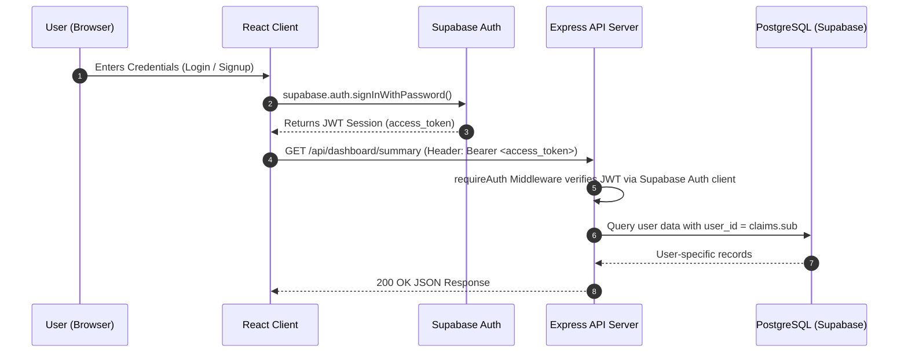

Checkpoint ID: 2026-08-19_1734
Generated At: 2026-08-19 17:34
Document Type: Architecture
Repository Branch: main
Commit SHA: 428d9fd989c42c8129f7da5095ab3dc517343b63
Scope: Phase 3 Multi-Tenancy Architecture Document
Status: Repository Snapshot

# Technical Architecture

## Application Architecture

Lockdin uses a monorepo architecture separating the Vite React client, the Express Node.js API server, shared database schemas, generated API types, and data processing scripts.

```mermaid
graph TD
    Client["Vite React Client Application<br/>(artifacts/revision-platform)"]
    API["Express API Server<br/>(artifacts/api-server)"]
    SupabaseAuth["Supabase Auth Service<br/>(JWT / Identity)"]
    Database["Supabase PostgreSQL Database<br/>(hazvcdrcvsxmuwdfiucx)"]
    Drizzle["Drizzle ORM Layer<br/>(lib/db)"]
    Importer["Syllabus CLI Importer<br/>(scripts/src/syllabus)"]

    Client -->|1. Authenticate / OAuth| SupabaseAuth
    Client -->|2. HTTP API Calls with Bearer Token| API
    API -->|3. Validate Token / Extract User ID| SupabaseAuth
    API -->|4. Queries via Drizzle ORM| Drizzle
    Drizzle -->|5. SQL Queries over Session Pooler (port 5432)| Database
    Importer -->|Import Validated CSV Syllabi| Drizzle
```

### Key Application Layers:
1. **Frontend Layer (`artifacts/revision-platform`)**: Single Page Application built with React 18, Vite, TypeScript, and Tailwind CSS. Communicates with the API server via a custom fetch client that attaches Supabase access tokens.
2. **API Server Layer (`artifacts/api-server`)**: Express.js REST API server mounted under `/api`. Handles request parsing, authentication verification, business logic, and error handling.
3. **Database Layer (`lib/db`)**: Drizzle ORM definitions, SQL migrations (`0000–0009`), and connection pool initialization using `pg`.
4. **Auth Layer (Supabase Auth)**: External authentication provider managing user registration, logins, JWT signing, password resets, and user sessions.
5. **Data Ingestion Layer (`scripts/src/syllabus`)**: Command-line tool for parsing, validating, and importing Cambridge A-Level CSV syllabi into PostgreSQL.

---

## Repository Structure

```text
lockdinapp/
├── artifacts/
│   ├── api-server/                # Express API backend server
│   │   ├── src/
│   │   │   ├── express-app.ts     # Express initialization & route mounting
│   │   │   ├── middlewares/       # Auth (requireAuth, optionalAuth) & error handling
│   │   │   ├── routes/            # REST API endpoints (subjects, syllabus, tasks, etc.)
│   │   │   └── lib/               # Business logic helpers (catalogue, topic progress)
│   ├── revision-platform/         # Vite + React frontend SPA
│   │   ├── src/
│   │   │   ├── components/        # React UI components (charts, grids, dialogs)
│   │   │   ├── pages/             # Route pages (Dashboard, Progress, PastPapers, Tasks)
│   │   │   ├── lib/               # Client helpers, custom fetch, auth state
│   │   │   └── App.tsx            # Main application router and context providers
│   └── mockup-sandbox/            # Prototyping sandbox
├── lib/
│   ├── db/                        # Shared database workspace package (@workspace/db)
│   │   ├── src/
│   │   │   ├── index.ts           # Drizzle client & pg.Pool initialization
│   │   │   └── schema/            # Drizzle table schemas (14 domain modules)
│   │   ├── migrations/            # SQL migration scripts (0000–0009)
│   │   └── drizzle.config.ts      # Drizzle CLI configuration
│   └── api-zod/                   # Shared API types & Zod schemas (@workspace/api-zod)
├── scripts/
│   └── src/
│       ├── syllabus/              # Syllabus CSV ingestion & normalization pipeline
│       └── preinstall.mjs         # Package manager lockfile check
├── data/
│   └── syllabi/
│       └── raw/                   # 9 validated Cambridge A-Level CSV files & audit reports
└── docs/                          # Comprehensive technical documentation & checkpoints
    ├── README.md                  # Master documentation index
    └── checkpoints/               # Immutable historical checkpoints
```

---

## Authentication Architecture

Authentication is powered by **Supabase Auth**.



### Identity and Profile Management:
- **`auth.users`**: Internal Supabase Auth user table holding email, hashed password, and user ID.
- **`public.profiles`**: Application-level profile table linked 1:1 to `auth.users.id` via foreign key constraint. Automatically populated via database trigger or API onboarding flow.
- **Route Guarding**:
  - `requireAuth`: Middleware enforcing valid JWT header; returns HTTP 401 for unauthenticated calls.
  - `optionalAuth`: Middleware decoding JWT if present, allowing guest preview calls while populating user context when logged in.

---

## Database Architecture

The schema is divided into **Shared Reference Data** (read-only for application users) and **User-Owned Data** (caller-scoped via RLS).

### 1. Shared Reference Data Tables

| Table | Description | Primary Key | Key Foreign Keys |
| --- | --- | --- | --- |
| `subjects` | Canonical subject catalogue (e.g. Physics 9702) | `id` (uuid) | None |
| `syllabus_versions` | Versioned specification per subject | `id` (uuid) | `subject_id` -> `subjects.id` |
| `syllabus_units` | Major units/modules within a syllabus version | `id` (uuid) | `syllabus_version_id` -> `syllabus_versions.id` |
| `syllabus_topics` | Specific topics within a unit | `id` (uuid) | `unit_id` -> `syllabus_units.id` |
| `syllabus_learning_outcomes` | Granular learning objectives within a topic | `id` (uuid) | `topic_id` -> `syllabus_topics.id` |
| `assessment_components` | Exam papers (e.g. Paper 4 A Level Structured) | `id` (uuid) | `syllabus_version_id` -> `syllabus_versions.id` |
| `learning_outcome_components` | Mappings between outcomes and exam papers | `id` (uuid) | `learning_outcome_id`, `component_id` |

### 2. User-Owned Data Tables

| Table | Description | Primary Key | RLS Owner Column |
| --- | --- | --- | --- |
| `profiles` | User profile, target grades, onboarding status | `id` (uuid) | `id` (matches `auth.users.id`) |
| `user_subjects` | Enrolled subjects per user | `id` (uuid) | `user_id` -> `auth.users.id` |
| `topic_progress` | User completion state & notes per topic | `id` (uuid) | `user_id` -> `auth.users.id` |
| `tasks` | Revision tasks created by user | `id` (uuid) | `user_id` -> `auth.users.id` |
| `past_paper_attempts` | Practice exam attempt scores & metadata | `id` (uuid) | `user_id` -> `auth.users.id` |
| `exam_dates` | Target upcoming exam dates per enrolled subject | `id` (uuid) | `user_id` -> `auth.users.id` |

---

## Table Relationships (ERD)

```mermaid
erDiagram
    subjects ||--o{ syllabus_versions : "has versions"
    syllabus_versions ||--o{ syllabus_units : "contains units"
    syllabus_versions ||--o{ assessment_components : "defines components"
    syllabus_units ||--o{ syllabus_topics : "contains topics"
    syllabus_topics ||--o{ syllabus_learning_outcomes : "defines outcomes"
    syllabus_learning_outcomes ||--o{ learning_outcome_components : "mapped to"
    assessment_components ||--o{ learning_outcome_components : "maps outcomes"

    profiles ||--o{ user_subjects : "enrolls in"
    subjects ||--o{ user_subjects : "referenced by"
    syllabus_versions ||--o{ user_subjects : "version enrolled"

    profiles ||--o{ topic_progress : "tracks progress"
    syllabus_topics ||--o{ topic_progress : "topic target"

    profiles ||--o{ tasks : "owns tasks"
    user_subjects ||--o? tasks : "optional subject link"
    syllabus_topics ||--o? tasks : "optional topic link"

    profiles ||--o{ past_paper_attempts : "logs attempts"
    subjects ||--o{ past_paper_attempts : "subject code link"
    assessment_components ||--o? past_paper_attempts : "optional component link"

    profiles ||--o{ exam_dates : "manages dates"
    user_subjects ||--o{ exam_dates : "subject enrolled"
```

---

## Data Ownership Model

The system enforces a strict boundary between **canonical reference data** and **personal user data**:

- **Canonical Syllabus Reference Data**: Loaded during deployment via the CLI importer into `subjects`, `syllabus_versions`, `syllabus_units`, `syllabus_topics`, `syllabus_learning_outcomes`, and `assessment_components`. These tables are strictly immutable to client API requests. Legacy user progress columns (`status`, `notes`) were removed from `syllabus_topics` in Migration `0007`.
- **Personal User Progress & State**: Created dynamically per user in `user_subjects`, `topic_progress`, `tasks`, `past_paper_attempts`, and `exam_dates`. Every user-owned row includes a mandatory `user_id` column referencing `auth.users.id`.
- **Overlay Pattern**: When a user queries a syllabus topic, the API server performs a LEFT JOIN from `syllabus_topics` to `topic_progress` filtered by `user_id = caller_id`. If no progress row exists, the API defaults to `status = 'not_started'` and `notes = null`.

---

## Security Architecture

1. **Row Level Security (RLS)**:
   - RLS is ENABLED on `profiles`, `user_subjects`, `topic_progress`, `tasks`, `past_paper_attempts`, and `exam_dates`.
   - Security policies enforce `auth.uid() = user_id` for SELECT, INSERT, UPDATE, and DELETE operations.
2. **API Bearer Authentication**:
   - Client requests include `Authorization: Bearer <jwt_token>`.
   - The Express API server validates the JWT signature against Supabase Auth public keys.
3. **Database Credentials**:
   - The application client uses `SUPABASE_PUBLISHABLE_KEY` (public, safe for browser).
   - The Express API server connects to PostgreSQL via `DATABASE_URL` using the pooler connection string.
   - `SUPABASE_SERVICE_ROLE_KEY` is restricted strictly to backend scripts and never exposed to frontend bundles.

---

## Past-Paper Architecture

Past-paper logging atomizes practice exam identity into structured parameters to support precise performance analytics:

### Stored Fields in `past_paper_attempts`:
- `user_id`: UUID of the student.
- `subject_code`: Cambridge subject code string (e.g. `"9702"` for Physics).
- `component_number`: Component integer (e.g. `4` for Paper 4).
- `variant_number`: Paper variant integer (e.g. `2` for Variant 2).
- `exam_session`: Examination series string (`"May/June"`, `"October/November"`, `"March"`).
- `exam_year`: Four-digit examination year integer (e.g. `2024`).
- `raw_score`: Student's achieved mark integer (e.g. `85`).
- `max_score`: Total available mark integer (e.g. `100`).
- `percentage`: Computed percentage float (`85.0`).

### Display Code Generation:
Full paper display codes are generated dynamically in application logic by combining component and variant numbers:

$$\text{Display Code} = \text{Subject Code} + \text{"/"} + \text{Component Number} + \text{Variant Number}$$

**Example**:
- `subject_code`: `"9702"`
- `component_number`: `4`
- `variant_number`: `2`
- **Generated Display Code**: `9702/42`

This atomized storage model avoids string manipulation issues in database queries while allowing instant search, component breakdown, and session trend line rendering across past paper sessions.
