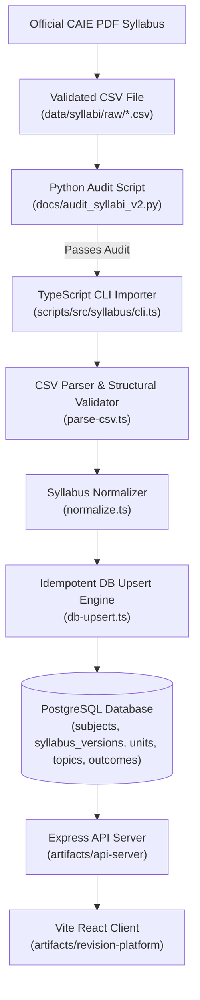

Checkpoint ID: 2026-08-19_1734
Generated At: 2026-08-19 17:34
Document Type: Data Pipeline
Repository Branch: main
Commit SHA: 428d9fd989c42c8129f7da5095ab3dc517343b63
Scope: Phase 3 Multi-Tenancy Data Ingestion Pipeline
Status: Repository Snapshot

# Reference-Data Ingestion Pipeline

## Architecture Overview

The Lockdin data pipeline processes official Cambridge Assessment International Education (CAIE) AS & A-Level syllabus specifications into normalized, database-backed reference tables.



---

## Source Data

Source CSV files are stored in `data/syllabi/raw/`. Each file contains a structured hierarchy of units, topics, subtopics, learning outcomes, and assessment components for one Cambridge A-Level subject.

### Current Validated Files in Repository:
1. `9231_further_mathematics.csv`
2. `9489_history.csv`
3. `9609_business.csv`
4. `9618_computer_science.csv`
5. `9700_biology.csv`
6. `9701_chemistry.csv`
7. `9702_physics.csv`
8. `9708_economics.csv`
9. `9709_mathematics.csv`
10. `_audit_report.json` (Structured validation audit output)

### Subject Manifest (`scripts/src/syllabus/manifest.ts`):
Each CSV file is mapped to a canonical subject entry in `SYLLABUS_IMPORT_MANIFEST`, specifying subject code, subject display name, theme accent color, CSV filename, and syllabus version metadata.

---

## CSV Schema

The expected CSV header structure for syllabus CSV files is:

```csv
Main Topic,Subtopic,Learning Outcome,Subject,Exam Board,Qualification,Level,Component Name,Paper Code,Duration (min),Total Marks,Weighting (%)
```

### Field Definitions:
- **`Main Topic`**: High-level syllabus unit or section (e.g., `"1 Physical chemistry"` or `"1 Motion"`).
- **`Subtopic`**: Topic title within the main unit (e.g., `"1.1 Formulae and equations"`).
- **`Learning Outcome`**: Granular objective statement describing what the student must know.
- **`Subject`**: Full subject name (e.g., `"Physics"`).
- **`Exam Board`**: Examination board (`"CAIE"` / `"Cambridge"`).
- **`Qualification`**: Qualification level (`"A Level"` / `"AS & A Level"`).
- **`Level`**: Qualification sub-level (`"AS"`, `"A2"`, or `"AS/A2"`).
- **`Component Name`**: Name of assessment component (e.g., `"Paper 4 A Level Structured Questions"`).
- **`Paper Code`**: Paper number/code (e.g., `"4"` or `"42"`).
- **`Duration (min)`**: Exam duration in minutes.
- **`Total Marks`**: Maximum raw marks for the component.
- **`Weighting (%)`**: Weighting percentage towards final grade.

---

## CSV → Database Mapping

| CSV Field | Database Destination Table | Column Name | Transformation / Notes |
| --- | --- | --- | --- |
| `Subject` + filename code | `subjects` | `code`, `name`, `color` | Upserts primary subject record using subject code |
| Manifest metadata | `syllabus_versions` | `version_label`, `is_current` | Creates version record linked to `subject_id` |
| `Main Topic` | `syllabus_units` | `title`, `unit_code`, `order_index` | Groups topics into ordered syllabus units |
| `Subtopic` | `syllabus_topics` | `title`, `topic_code`, `order_index` | Stores syllabus topic hierarchy |
| `Learning Outcome` | `syllabus_learning_outcomes` | `description`, `outcome_code` | Stores granular learning outcomes per topic |
| `Component Name` | `assessment_components` | `name`, `component_number`, `duration_minutes`, `total_marks`, `weighting_percentage` | Stores exam paper component specifications |
| Structural relation | `learning_outcome_components` | `learning_outcome_id`, `component_id` | Maps learning outcomes to associated paper components |

---

## Import Process & Commands

The ingestion pipeline is executed via pnpm CLI scripts configured in `scripts/package.json`:

### 1. Perform Dry Run (Validate without DB mutation):
```bash
pnpm --filter scripts import-syllabi:dry
```

### 2. Execute Real Database Import (Idempotent DB Upsert):
```bash
pnpm --filter scripts import-syllabi
```

### 3. Clean Placeholder Data:
```bash
pnpm --filter scripts cleanup-placeholder
```

### 4. Verify Syllabus Import Unit Tests:
```bash
pnpm --filter scripts test
```

---

## Import Safety & Idempotency

1. **Transactional Execution**: Database upserts for each subject run inside SQL transactions. If any record fails validation or insertion, the transaction rolls back cleanly without leaving partial data.
2. **Idempotent Upsert Strategy**: Uses Drizzle `ON CONFLICT` clauses against unique composite indexes (e.g. `(subject_id, version_label)` for versions, `(syllabus_version_id, title)` for units). Re-running the importer updates existing rows rather than duplicating data.
3. **Order Preservation**: Preserves the explicit sequential order of units, topics, subtopics, and learning outcomes as specified in the source CSV via `order_index` columns.
4. **Validation Guard**: Source CSVs undergo strict validation in `parse-csv.ts` before database execution, verifying header compliance, non-empty fields, valid numerical durations/marks, and correct subject code alignment.

---

## Runtime Data Flow

Once imported into PostgreSQL shared reference tables, data flows to the user interface as follows:

```text
User selects subject during onboarding or settings
   ↓
API creates row in caller's user_subjects table (linked to subject_id & syllabus_version_id)
   ↓
Client requests /api/syllabus/:subjectCode or /api/user-subjects
   ↓
API Server loads shared units, topics, & learning outcomes from DB
   ↓
API Server LEFT JOINs caller's topic_progress overlay using authenticated user_id
   ↓
Client receives combined syllabus hierarchy with user-specific progress status & notes
```
