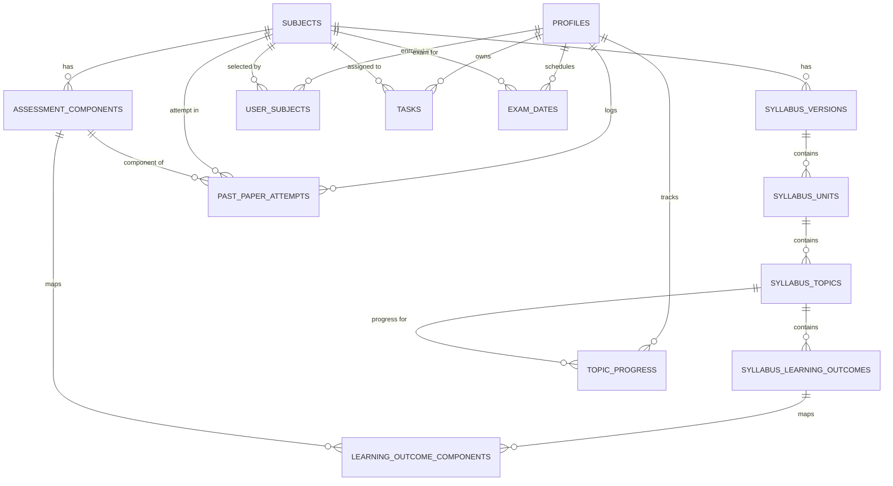

Checkpoint ID: 2026-08-24_1705
Generated At: 2026-08-24 17:05
Document Type: Technical Architecture
Repository Branch: main
Commit SHA: f76fc2191af65c067c19178e93407e84f222870e
Scope: System Architecture, Data Models, Security & Hardened API Boundaries
Status: Repository Snapshot

# Technical Architecture

## Application Architecture

Lockdin is structured as a TypeScript monorepo consisting of a React Single Page Application (SPA) frontend, an Express REST API backend, a shared Drizzle ORM database package, and shared generated Zod validation contracts.

```mermaid
flowchart TD
    subgraph Client ["Client Tier (Browser)"]
        FE["React 18 + Vite SPA<br/>(Wouter, TanStack Query, Tailwind CSS)"]
    end

    subgraph Edge ["Edge / Ingress Tier (Vercel)"]
        Ingress["Vercel Serverless Gateway"]
    end

    subgraph API ["API Server Tier (Express 5 Node.js)"]
        ReqId["1. Request ID Middleware<br/>(crypto.randomUUID -> pinoHttp genReqId)"]
        ReqIdHeader["2. Response Header<br/>(X-Request-Id)"]
        CORS["3. CORS Middleware<br/>(Allowed Origins, OPTIONS 204)"]
        Parsers["4. Body Parsers<br/>(express.json, urlencoded)"]
        GlobalAuth["5. Global Auth Policy<br/>(Fail-secure /api gate, reviewed exceptions)"]
        APIRouter["6. Express Route Handlers<br/>(Zod safeParse validation, req.userId derivation)"]
        ErrHandler["7. Centralized Error Handler<br/>(Pino logging, sanitized JSON 500 responses)"]
    end

    subgraph DataLayer ["Data & Identity Tier (Supabase)"]
        AuthServer["Supabase Auth Service<br/>(JWT issuance & getClaims verification)"]
        PG["PostgreSQL Database"]
        subgraph DBSchema ["Database Entities"]
            RefData[("Shared Reference Tables<br/>(subjects, syllabus, components)")]
            UserData[("User-Owned Tables<br/>(profiles, user_subjects, tasks,<br/>topic_progress, attempts, exam_dates)")]
            RLS["Row Level Security Policies<br/>(auth.uid() = user_id)"]
        end
    end

    FE -->|HTTPS Request + Bearer JWT| Ingress
    Ingress --> ReqId
    ReqId --> ReqIdHeader --> CORS --> Parsers --> GlobalAuth --> APIRouter --> ErrHandler

    GlobalAuth -.->|Verify JWT claims| AuthServer
    APIRouter -->|Request-Scoped Client with Bearer Token| RLS
    APIRouter -->|Connection Pooler (Port 5432)| PG
    RLS --> UserData
    PG --> RefData
```

---

## Repository Structure

```text
lockdinapp/
├── artifacts/
│   ├── api-server/             # Express 5 REST API server
│   │   ├── src/
│   │   │   ├── express-app.ts  # Express app assembly & global middleware pipeline
│   │   │   ├── middlewares/    # global-auth-policy, request-id, require-auth, optional-auth
│   │   │   ├── routes/         # Modular route controllers (subjects, tasks, attempts, etc.)
│   │   │   └── lib/            # Logger, error-handler, supabase-user-client, supabase-verifier
│   │   └── scripts/            # require-local-supabase safety guard
│   ├── revision-platform/      # React 18 + Vite frontend client
│   │   ├── src/
│   │   │   ├── App.tsx         # Routing, auth wrapping, error boundaries
│   │   │   ├── components/     # AppShell, RequireAuth, charts, dashboard widgets
│   │   │   ├── pages/          # Page components (dashboard, subjects, past-papers, settings)
│   │   │   └── lib/            # API client hooks, custom-fetch, formatting utilities
│   │   └── vitest.config.ts    # Frontend testing configuration
│   └── mockup-sandbox/         # Isolated UI prototype workbench
├── lib/
│   ├── db/                     # Drizzle ORM schemas, database client, and migrations
│   │   ├── src/schema/         # Table schemas for reference and user data
│   │   └── migrations/         # SQL migration chain 0000–0009 & meta journal
│   └── api-zod/                # Generated TypeScript types & Zod schemas from OpenAPI specs
├── data/
│   └── syllabi/raw/            # 9 validated Cambridge AS & A-Level CSV datasets & audit reports
├── scripts/
│   └── src/syllabus/           # Syllabus CSV parser, normalizer, and idempotent DB importer
├── docs/                       # Architectural plans, cursor reports, and timestamped checkpoints
└── package.json                # Root monorepo configuration & pnpm workspaces
```

---

## Authentication & Authorization Architecture

### Identity Lifecycle Flow

1. **Client Authentication**: The student registers or authenticates directly against Supabase Auth (`supabase.auth.signInWithPassword` or `signUp`).
2. **JWT Acquisition**: Supabase returns an access token JWT signed with the project's JWT secret.
3. **API Request Dispatch**: The client attaches the JWT as a `Bearer <token>` in the standard `Authorization` request header.
4. **Global Fail-Secure Gate (`global-auth-policy.ts`)**:
   - Mounted globally at `app.use("/api", globalAuthPolicy)` ahead of all route handlers.
   - Evaluates incoming request against the reviewed `API_AUTH_EXCEPTIONS` table.
   - Genuine CORS `OPTIONS` preflight requests bypass authentication and receive a `204 No Content`.
   - Explicit `public` endpoints (e.g. `/healthz`, `/healthz/db`, `/subjects`) continue unauthenticated.
   - Explicit `optional` endpoints (e.g. `/subjects/:subjectId/syllabus`) attempt token verification if an `Authorization` header is present, but continue anonymously if omitted.
   - All other routes fall through to `requireAuth`.
5. **Token Verification (`require-auth.ts`)**:
   - Uses `getSupabaseVerifier().auth.getClaims(token)` to cryptographically verify token integrity and expiration.
   - Extracts the authenticated subject UUID (`claims.sub`).
   - Validates UUID syntax against RFC 4122.
   - Populates `req.userId = sub` and `req.accessToken = token`.
   - If the token is missing, expired, or invalid, immediately emits a clean 401 `{ "error": "Unauthorized" }`.
6. **Request-Scoped Supabase Client**:
   - Routes performing RLS-protected queries instantiate a request-scoped Supabase client via `createSupabaseUserClient(req.accessToken)`.
   - Queries execute under PostgreSQL session identity matching `auth.uid() = req.userId`.

---

## Request Tracing & Correlation Architecture

Every request passing through the API server receives a unique, server-authoritative request correlation identifier:

1. **Identifier Generation**: `crypto.randomUUID()` generates a RFC 4122 v4 UUID inside `generateRequestId()`. Client-supplied request IDs are ignored to prevent spoofing.
2. **Pino HTTP Binding**: `pinoHttp({ genReqId: generateRequestId })` assigns the UUID to `req.id` and attaches it to all request log entries.
3. **Response Header Injection**: `requestIdHeader` middleware sets `X-Request-Id: <uuid>` on every HTTP response (including 200, 400, 401, 403, 404, and 500 status codes).
4. **Log Correlation**: Application errors logged via `logger.error` or `errorHandler` include `req.id`, enabling instant correlation between frontend error reports and server logs.

---

## Database Architecture

The database is divided cleanly into **Shared Canonical Reference Data** and **User-Owned Personal Data**.



### 1. Shared Canonical Reference Tables (7 Tables)

These tables contain authoritative Cambridge curriculum specifications. They are globally readable and completely devoid of user-specific state:

1. `subjects`: Canonical subject records (e.g. Physics `9702`, Chemistry `9701`, Mathematics `9709`).
2. `syllabus_versions`: Versioned syllabus specifications with validation periods (e.g., `2022-2024`, `2025-2027`).
3. `syllabus_units`: Major curriculum units (e.g., "1 Physical quantities and units").
4. `syllabus_topics`: Discrete topics and subtopics within units (e.g., "1.1 Physical quantities", "1.2 SI units").
5. `syllabus_learning_outcomes`: Specific, numbered learning objectives.
6. `assessment_components`: Individual examination components (e.g. Paper 1 Multiple Choice, Paper 4 A Level Structured Questions).
7. `learning_outcome_components`: Many-to-many mapping connecting learning outcomes to the specific assessment components that test them.

### 2. User-Owned Personal Data Tables (6 Tables)

These tables store individual student progress and revision state. Every record has a mandatory `user_id uuid` column referencing `auth.users(id)` and is protected by PostgreSQL Row Level Security (RLS):

1. `profiles`: Student profile attributes (`full_name`, `target_grade`, `created_at`, `updated_at`).
2. `user_subjects`: Personal subject enrollment links (`user_id`, `subject_id`, `created_at`).
3. `topic_progress`: Student mastery state per syllabus topic (`user_id`, `topic_id`, `status` (`not_started` | `in_progress` | `completed`), `notes`, `updated_at`).
4. `tasks`: Actionable revision items (`user_id`, `subject_id`, `topic_id`, `title`, `description`, `priority` (`low` | `medium` | `high`), `due_date`, `is_completed`).
5. `past_paper_attempts`: Practice exam attempts (`user_id`, `subject_id`, `component_id`, `variant`, `session`, `year`, `score`, `total_marks`, `percentage`, `date_attempted`, `time_taken_minutes`, `notes`).
6. `exam_dates`: Target upcoming examination dates per subject (`user_id`, `subject_id`, `exam_date`, `created_at`).

---

## Security Architecture

1. **Row Level Security (RLS)**:
   - Enforced on all 6 user-owned tables.
   - Policies strictly constrain operations:
     ```sql
     CREATE POLICY "Users can only access their own records"
     ON <user_table>
     FOR ALL
     USING (auth.uid() = user_id)
     WITH CHECK (auth.uid() = user_id);
     ```
2. **Fail-Secure Global Authorization Policy**:
   - All `/api` routes require a valid Supabase Auth Bearer JWT unless explicitly exempted in `global-auth-policy.ts`.
   - Adding a new endpoint without explicit classification defaults to requiring authentication (prevents accidental data exposure).
3. **Caller-Scoped Backend Operations**:
   - Route handlers derive user identity exclusively from `req.userId` (populated from verified JWT claims).
   - Route handlers reject or ignore client-supplied `user_id` fields in request bodies or query strings.
4. **Input Validation with Generated Zod Schemas**:
   - All input-bearing endpoints parse request bodies through Zod schemas generated in `@workspace/api-zod`.
   - Invalid payloads return immediate 400 Bad Request responses with structured error details, preventing malformed inputs from reaching the database.
5. **Secret & Credential Separation**:
   - Server-only secrets (`DATABASE_URL`, `DIRECT_DATABASE_URL`, `SUPABASE_SERVICE_ROLE_KEY`) are restricted to backend runtimes and build scripts.
   - Client code only receives public environment variables (`VITE_SUPABASE_URL`, `VITE_SUPABASE_ANON_KEY`).
6. **Serverless Connection Management**:
   - The Express API server connects to Supabase PostgreSQL via the Session Pooler (port 5432) using `max: 1` pool size to avoid connection exhaustion during high-concurrency serverless scaling.

---

## Past-Paper Architecture

The past-paper logging subsystem uses an **atomized component-variant identity model** rather than storing composite or free-text paper codes:

### Paper Identity Model

A past paper attempt is defined by distinct atomic fields:
- **Subject**: Foreign key to `subjects.id` (e.g. `9702` Physics).
- **Component**: Foreign key to `assessment_components.id` (e.g. Paper `4` A Level Structured Questions).
- **Variant**: Integer between 1 and 5 (e.g. `2`).
- **Session**: Enum constrained to `'May/June'`, `'Oct/Nov'`, `'Feb/Mar'`, `'Specimen'`.
- **Year**: 4-digit integer (e.g. `2024`).

### Dynamic Code Derivation

The display paper code (e.g. `9702/42`) is **derived dynamically at query/presentation time**:

$$\text{Display Code} = \text{Subject Code} + \text{"/"} + \text{Component Number} + \text{Variant Number}$$

*Example*: Subject `9702`, Component `4`, Variant `2` $\rightarrow$ `9702/42`.

This guarantees:
1. Referential integrity against the canonical `assessment_components` table.
2. Robust multi-dimensional analytics by subject, component, or variant without string parsing.
3. Clean prevention of typos or non-standard formatting.
