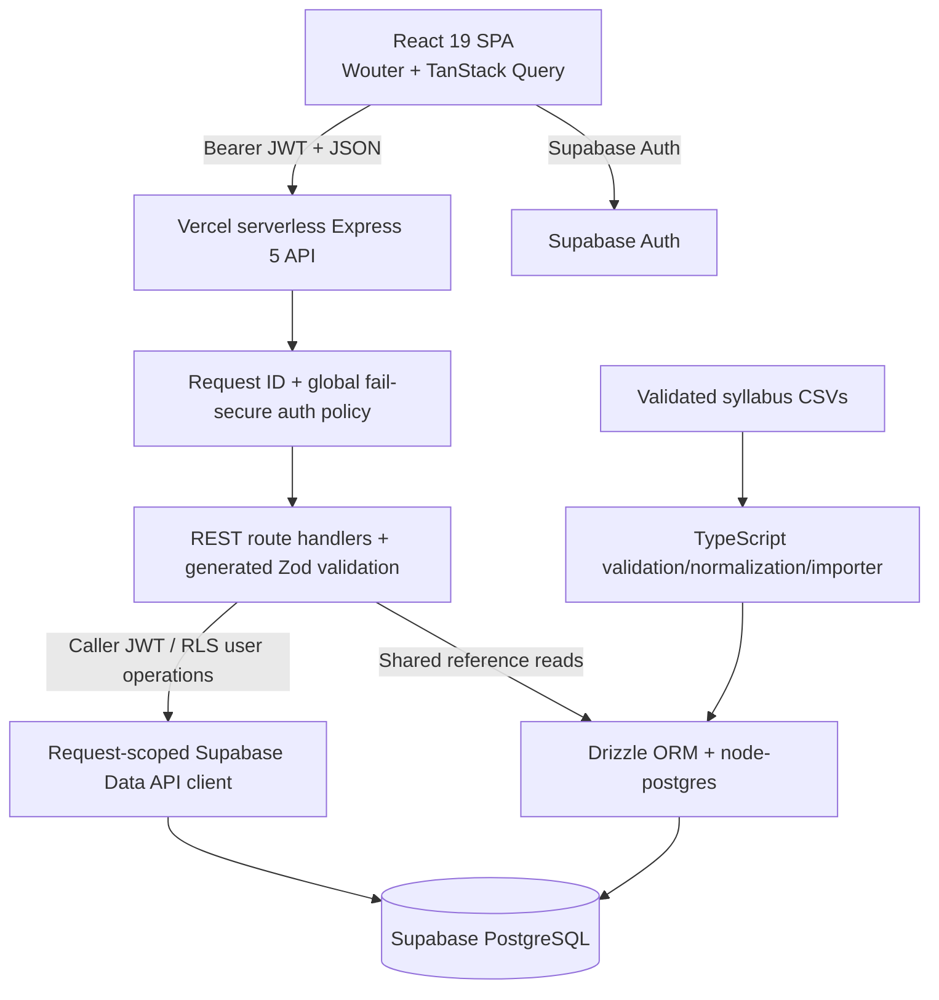
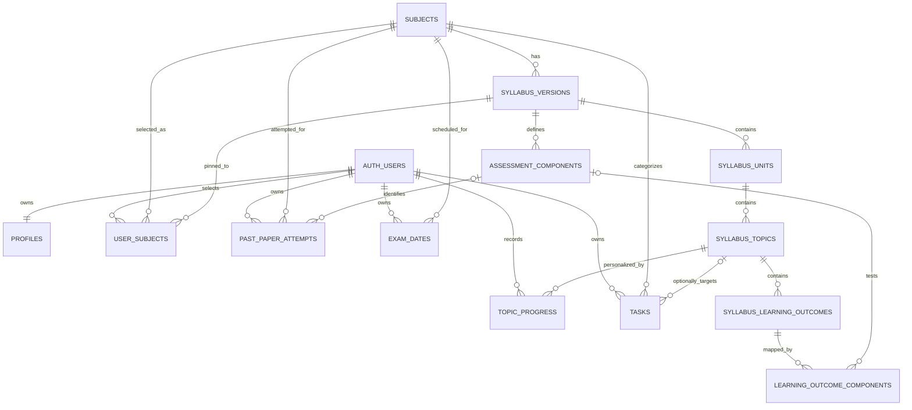

Checkpoint ID: 2026-08-29_0016
Generated At: 2026-08-29 00:16
Document Type: Architecture
Repository Branch: main
Commit SHA: 0d2f1f429894ccb4db48e5336d8f67346d0c81c6
Scope: Actual post-Phase 5 application, authentication, database, security, and past-paper architecture
Status: Repository Snapshot

# Technical Architecture

## Application Architecture



The deployed frontend is a Vite single-page application. It obtains and refreshes a Supabase session, provides the access token to the generated API client, and uses TanStack Query for server state. Vercel rewrites `/api/*` to a bundled Express serverless function and non-API paths to `index.html`.

The API assigns a server-authoritative UUID request ID, parses requests, applies a global authentication policy, dispatches route handlers, and uses centralized error handling. Public shared-reference reads use Drizzle. User-owned reads/writes generally use a request-scoped Supabase client carrying the verified caller token so PostgreSQL RLS independently enforces ownership.

## Repository Structure

| Path | Purpose |
| --- | --- |
| `artifacts/revision-platform/` | Deployed React SPA, pages, UI components, auth provider, query state, and frontend tests. |
| `artifacts/api-server/` | Express application, serverless/standalone entry points, middleware, route handlers, and API tests. |
| `artifacts/mockup-sandbox/` | Component-preview/design tooling; not the production application. |
| `lib/api-spec/` | OpenAPI source and Orval configuration. |
| `lib/api-zod/` | Generated Zod request/response contracts and types. |
| `lib/api-client-react/` | Generated frontend client/hooks plus authenticated custom fetch. |
| `lib/db/` | Drizzle schema, runtime pool, migrations, and migration tooling. |
| `scripts/src/syllabus/` | CSV validation, normalization, import, and narrowly scoped legacy-placeholder cleanup. |
| `data/syllabi/raw/` | Nine validated syllabus CSVs and tracked audit report. |
| `supabase/` | Local Supabase service configuration; not application schema migrations. |
| `docs/checkpoints/` | Immutable chronological repository snapshots. |
| `docs/cursor/reports/` | Detailed implementation, QA, deployment, and phase-closeout evidence. |

## Authentication Architecture

1. The browser singleton created by `supabase-browser.ts` uses only `VITE_SUPABASE_URL` and `VITE_SUPABASE_PUBLISHABLE_KEY`. Session persistence, refresh, and callback URL detection are enabled.
2. `AuthProvider` listens to Supabase auth changes, resolves the current `/api/profile`, retries initial profile resolution on a short deterministic schedule, and signs out rather than treating an unresolved profile as unauthenticated onboarding state.
3. Login uses email/password; signup passes `full_name` as display metadata and redirects through `/auth/callback`; optional Google OAuth is feature-flagged; password reset/update use Supabase Auth.
4. The generated API client's custom fetch attaches the current bearer access token. A global 401 handler clears protected state, signs out, clears the query cache, and redirects to login.
5. Express applies `globalAuthPolicy` to every `/api` request. Exact public exceptions are health, subject catalogue/detail/components, and deliberate read-only 403 subject mutation handlers. Syllabus reads use optional auth. All unclassified routes require auth.
6. `requireAuth` verifies the JWT using the server Supabase publishable-key client and `auth.getClaims(token)`, validates `claims.sub` as a UUID, then sets request-scoped `userId` and `accessToken`.
7. `profiles.id` and user-owned `user_id` columns relate to Supabase `auth.users`. A migration-managed new-user trigger inserts the initial profile. Onboarding completion and subject replacement are reviewed RPC operations.

There is no active mock/local-storage authentication path. Obsolete keys such as `lockdin_auth`, `lockdin_user`, and `onboarded` are removed on auth-provider startup.

## Database Architecture

### Shared Reference Data

| Table | Role |
| --- | --- |
| `subjects` | Canonical subject identity: name, four-digit code, display color. |
| `syllabus_versions` | Subject-linked source/version metadata, current flag, optional validity bounds, source filename, import timestamp. |
| `syllabus_units` | Ordered main topics for one syllabus version; includes denormalized `subject_id`. |
| `syllabus_topics` | Ordered subtopics under a unit; contains no user status or notes after migration `0007`. |
| `syllabus_learning_outcomes` | Ordered normalized outcome text under a topic. |
| `assessment_components` | Version-linked base paper code, level, name, duration, marks, weighting, and order. |
| `learning_outcome_components` | Many-to-many outcome/component occurrence with preserved level; component may be null for syllabus-wide content. |

### User-Owned Data

| Table | Primary ownership/model |
| --- | --- |
| `profiles` | UUID primary key equals auth user ID; name, username, level, exam session, onboarding timestamps. |
| `user_subjects` | Composite `(user_id, subject_id)` membership with a syllabus-version pin constrained to the same subject. |
| `topic_progress` | Composite `(user_id, topic_id)` state and notes; absent row means default not-started/no-note. |
| `tasks` | User-owned task with required subject, optional topic, deadline, priority, estimate, and completion state. |
| `past_paper_attempts` | User-owned paper attempt with structured paper identity and scoring data. |
| `exam_dates` | User-owned subject/paper label, date, and optional notes. |

Ten Drizzle migrations (`0000`-`0009`) are recorded. Existing migration files are the historical schema authority and must not be edited in place.

## Relationships



Important integrity constraints include unique subject codes; unique version/source per subject; ordered hierarchy natural keys; the subject/version composite foreign key on memberships; per-user topic progress uniqueness; valid progress statuses; notes length; attempt variant/year/score checks; and user/date indexes for attempt and exam-date reads.

## Data Ownership Model

Shared canonical syllabus data is imported once and reused by all users. It must never carry personal completion status or notes. The `syllabus_topics.status` and `syllabus_topics.notes` legacy columns were removed in migration `0007`.

Individual user data is keyed by the authenticated Supabase user UUID. Subject membership pins a user to a concrete syllabus version. Progress is an overlay on shared topics, tasks optionally point to shared topics, and past-paper attempts point to shared assessment components. Query caches and browser-local preference/reminder keys are also cleared or scoped at account boundaries.

## Security Architecture

- The browser receives only Supabase URL and publishable-key variables. No service-role key is used by frontend code.
- `DATABASE_URL`, `DIRECT_DATABASE_URL`, `SUPABASE_URL`, and `SUPABASE_PUBLISHABLE_KEY` are server/tooling variables. A service-role variable is only documented as a future server-only option and is not used by current runtime code.
- Global authentication fails secure: a new API route is protected unless added to the exact reviewed exception table.
- Route handlers derive ownership from verified `req.userId`. Input-bearing endpoints use generated Zod schemas and reject ownership fields.
- A request-scoped Supabase client passes the caller JWT to the Data API. RLS remains authoritative even if an API query is incorrectly scoped.
- RLS and direct privileges are table-specific:
  - `profiles`: authenticated SELECT and limited-column UPDATE on own row.
  - `tasks`: authenticated SELECT/INSERT/UPDATE/DELETE on own rows.
  - `user_subjects`: direct authenticated SELECT only after migration `0005`; writes use reviewed RPCs.
  - `topic_progress`: direct authenticated SELECT only; upsert/reset use reviewed RPCs.
  - `past_paper_attempts`: authenticated SELECT/INSERT/DELETE; no UPDATE.
  - `exam_dates`: authenticated SELECT/INSERT/DELETE; no UPDATE.
- Migration-defined `SECURITY DEFINER` functions in `public` are explicitly revoked from `PUBLIC` and `anon`, granted narrowly where needed, set a controlled search path, and validate `auth.uid()`/membership. Any change to these functions requires a new security review.
- Public reference data is read through the application API. Repository code does not establish that every shared table is directly granted through the Data API; do not assume direct browser access.
- API request IDs are server-generated, returned as `X-Request-Id`, and correlated with Pino logs; client-supplied IDs are ignored.
- Database URL validation redacts full connection details. Vercel/serverless Supabase session-pooler port 5432 is rejected; application runtime uses transaction pooling on port 6543 with `max: 1`, bounded connect/query/statement timeouts, and `allowExitOnIdle`.

## Past-Paper Architecture

Paper identity is atomized across shared component metadata and the user's attempt:

| Dimension | Storage/constraint |
| --- | --- |
| Subject | `past_paper_attempts.subject_id` -> `subjects.id` |
| Component | Nullable `component_id` -> `assessment_components.id`; create API requires a valid component belonging to the subject |
| Base paper code | `assessment_components.paper_code`, such as `9702/4` |
| Variant | Nullable integer `1`-`5` on the attempt |
| Session | `May/June`, `Oct/Nov`, `Feb/Mar`, or `Specimen` |
| Year | Four-digit integer on the attempt |
| Attempt data | score, total marks, computed percentage, date attempted, optional minutes and notes |

A variant-specific full code is generated for display, not used as the primary attempt identity:

```text
Subject: Physics (9702)
Assessment component paper_code: 9702/4
Variant: 2
Session/year: May/June 2024

Display label: 9702/42 — May/June 2024
```

The API validates that the selected component belongs to the selected subject, computes percentage server-side, orders attempts by attempted date and ID, and enriches stored IDs with subject/component labels at read time. List, create, and delete are implemented; update is not.
