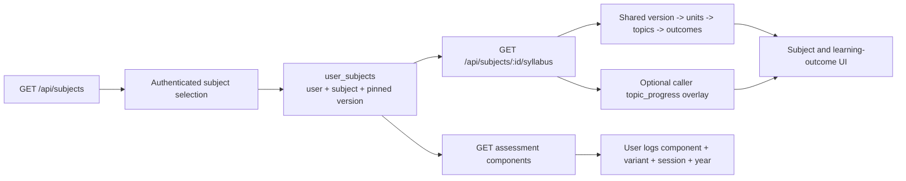

Checkpoint ID: 2026-08-29_0016
Generated At: 2026-08-29 00:16
Document Type: Data Pipeline
Repository Branch: main
Commit SHA: 0d2f1f429894ccb4db48e5336d8f67346d0c81c6
Scope: Current syllabus/reference-data sources, validation, normalization, import, safety, and runtime delivery
Status: Repository Snapshot

# Reference Data Pipeline

```text
Official Cambridge syllabus material
  -> repository-maintained extracted CSVs
  -> Python semantic audit + tracked JSON report
  -> TypeScript runtime schema validation
  -> manifest-backed normalization
  -> per-subject Drizzle transaction
  -> shared PostgreSQL reference tables
  -> Express reference/syllabus endpoints
  -> React subject, syllabus, progress, and past-paper views
```

The repository begins at the extracted CSV stage. Original official PDFs and extraction provenance are not encoded by the importer itself; the repository CSVs plus manifest are its canonical input.

## Source Data

Source directory: `data/syllabi/raw/`

Filename convention: `<four-digit-subject-code>_<snake_case_subject>.csv`

| File | Rows | Normalized units | Topics | Outcomes | Components | Outcome/component relationships |
| --- | ---: | ---: | ---: | ---: | ---: | ---: |
| `9231_further_mathematics.csv` | 142 | 4 | 24 | 84 | 7 | 142 |
| `9489_history.csv` | 659 | 21 | 81 | 659 | 4 | 659 |
| `9609_business.csv` | 690 | 5 | 34 | 345 | 4 | 690 |
| `9618_computer_science.csv` | 366 | 19 | 45 | 366 | 4 | 366 |
| `9700_biology.csv` | 900 | 22 | 62 | 405 | 8 | 900 |
| `9701_chemistry.csv` | 798 | 25 | 104 | 554 | 5 | 798 |
| `9702_physics.csv` | 518 | 27 | 81 | 373 | 5 | 518 |
| `9708_economics.csv` | 518 | 7 | 51 | 259 | 4 | 518 |
| `9709_mathematics.csv` | 226 | 6 | 38 | 153 | 9 | 226 |
| **Total** | **4,817** | **136** | **520** | **3,198** | **50** | **4,817** |

The normalization counts above were produced by the actual TypeScript validation command during this checkpoint. The tracked `_audit_report.json` reports PASS for all nine files and zero CRITICAL/HIGH/MEDIUM/LOW issues. Informational findings document legitimate repetitions and disconnected blocks; they are reviewed signals, not importer errors.

`docs/audit_syllabi_v2.py` is the standalone semantic audit tool. It parses robust CSV, checks exact shape, required data, numeric ranges, component consistency, duplicate/outcome repetition, editorial artifacts, and ordering signals, then rewrites `data/syllabi/raw/_audit_report.json`.

## CSV Schema

Every manifest CSV is required to use this exact ordered header:

```text
Main Topic
Subtopic
Learning Outcome
Subject
Exam Board
Qualification
Level
Component Name
Paper Code
Duration (min)
Total Marks
Weighting (%)
```

The TypeScript validator requires Main Topic, Learning Outcome, Subject, Exam Board, Qualification, and Level. Allowed levels are `AS Level`, `A Level`, and `AS & A Level`. Numeric component fields may be blank but must be numeric when present. Nonblank paper codes are expected to match `####/#`.

## CSV -> Database Mapping

| CSV field | Database destination | Actual transformation |
| --- | --- | --- |
| Main Topic | `syllabus_units.title`, `order_index` | First occurrence creates one ordered unit per distinct title in the syllabus version. |
| Subtopic | `syllabus_topics.title`, `order_index` | Distinct within its parent unit; first occurrence order is preserved. |
| Learning Outcome | `syllabus_learning_outcomes.outcome`, `order_index` | Repeated text within the same topic is normalized to one outcome. |
| Subject | Diagnostic only for identity; manifest controls `subjects.name` | A mismatch creates an operator notice. |
| Exam Board | `syllabus_versions.exam_board` | First validated row supplies the value after file-level consistency checks. |
| Qualification | `syllabus_versions.qualification` | First validated row supplies the value after file-level consistency checks. |
| Level | `assessment_components.level`; `learning_outcome_components.level` | Part of the component natural key and preserved for componentless occurrences. |
| Component Name | `assessment_components.component_name` | Stored once per syllabus-version/paper-code/level key. |
| Paper Code | `assessment_components.paper_code` | Stored as the base code, for example `9702/4`; not parsed into a separate component-number column. |
| Duration (min) | `assessment_components.duration_minutes` | Numeric value or null. |
| Total Marks | `assessment_components.total_marks` | Numeric value or null. |
| Weighting (%) | `assessment_components.weighting_percent` | Numeric/real value or null. |
| Row occurrence | `learning_outcome_components` | Links normalized outcome to component and level; component can be null for syllabus-wide rows. |
| Manifest subject code | `subjects.code` | Canonical identity; not inferred from CSV paper code. |
| Manifest subject name/color | `subjects.name`, `subjects.color` | Used only when the subject row does not already exist. |
| Manifest file/version metadata | `syllabus_versions` | Source filename is the natural key with subject; label/current/bounds are updateable. |

Current manifest validity bounds are intentionally null because official validity windows were not reliably recoverable from repository evidence. Every entry is labeled `Current syllabus` and `isCurrent: true`.

## Import Process

Commands below exist in current package scripts.

### Standalone semantic audit

```bash
python docs/audit_syllabi_v2.py data/syllabi/raw
```

This rewrites `_audit_report.json`. Review the diff; do not run it casually when checkpoint scope forbids reference-data changes.

### Runtime validation

```bash
pnpm --filter @workspace/scripts syllabus:validate
```

Current checkpoint behavior: all files validate and normalize successfully, but without `DATABASE_URL` the command then exits 1 during unconditional `pool.end()` cleanup. Validation performs no intended database writes; the cleanup coupling is an implementation defect.

### Import dry run

```bash
pnpm --filter @workspace/scripts syllabus:import --dry-run
```

Optional subject filtering uses the implemented comma-separated `--files=` argument, despite its name:

```bash
pnpm --filter @workspace/scripts syllabus:import --dry-run --files=9702
pnpm --filter @workspace/scripts syllabus:import --files=9701,9702
```

Dry run performs no intended database writes but currently encounters the same pool-shutdown coupling. A configured database URL is therefore required for a clean process exit until the defect is fixed.

### Real import

```bash
pnpm --filter @workspace/scripts syllabus:import
```

This requires `DATABASE_URL` and mutates whichever database it targets. Verify the target explicitly before running. Do not point routine tests or documentation checks at production.

### Re-import verification

Run the real import a second time against the same disposable or intended database and inspect the reported counters:

```bash
pnpm --filter @workspace/scripts syllabus:import
```

On unchanged input, entity counters should report existing/unchanged records. Junction relationships are deliberately deleted and recreated per syllabus version, so their `created` count remains nonzero; that alone is not evidence of duplicates.

### Related database commands

```bash
pnpm --filter @workspace/db migrate
pnpm supabase:start
pnpm supabase:status
pnpm supabase:stop
```

Drizzle migrations own application schema. Supabase CLI scripts only manage the local service stack. Do not use `supabase db push` as a second application-schema history.

## Import Safety

- Validation occurs before each subject import. Header order, row width, UTF-8 replacement characters, required fields, numeric fields, file identity consistency, and contradictory component metadata can stop that subject.
- Normalization collapses repeated units/topics/outcomes and preserves each unique component/level occurrence.
- Each subject is imported inside one Drizzle transaction. Failure rolls back that subject only; the complete nine-subject run is not one global transaction.
- Natural keys and database unique constraints prevent duplicate subjects, versions, units, topics, outcomes, and components.
- Existing matching rows are diffed in memory and updated only when managed fields change. Bulk selects/inserts avoid per-row hosted round trips.
- Units, topics, outcomes, components, and relationships retain first-occurrence ordering through `order_index`.
- Outcome/component junction rows for all current outcomes in the version are deleted and rebuilt inside the same transaction, including nullable-component special cases.
- The importer does not touch `profiles`, `user_subjects`, `topic_progress`, `tasks`, `past_paper_attempts`, or `exam_dates`.
- The importer does not currently perform complete source-of-truth deletion reconciliation for units/topics/outcomes/components removed from a CSV. Treat source deletion as a reviewed migration/data-cleanup event.
- The one-off `syllabus:cleanup-placeholders` script is legacy cleanup tooling with narrow title/content guards; it is not part of normal import.

## Runtime Data Flow



The catalogue and subject/component reference endpoints are public. Syllabus content is public with optional authenticated progress overlay. Subject membership, topic mutation, tasks, attempts, exam dates, dashboard, progress, and profile operations require authentication. User state remains separate from imported reference rows at every stage.

## Current Pipeline Status

- Repository source data: IMPLEMENTED and tracked.
- Python semantic audit: IMPLEMENTED; latest report PASS for all nine files.
- TypeScript validation/normalization: IMPLEMENTED; all 4,817 rows validated during this checkpoint.
- Transactional importer: IMPLEMENTED and covered by DB integration tests when a database is available.
- Hosted reference data: recorded as imported by release evidence; not directly counted via SQL during this checkpoint.
- Offline validation/dry-run process exit: PARTIALLY IMPLEMENTED because of unconditional database-pool shutdown coupling.
- Full deletion reconciliation: NOT IMPLEMENTED.
