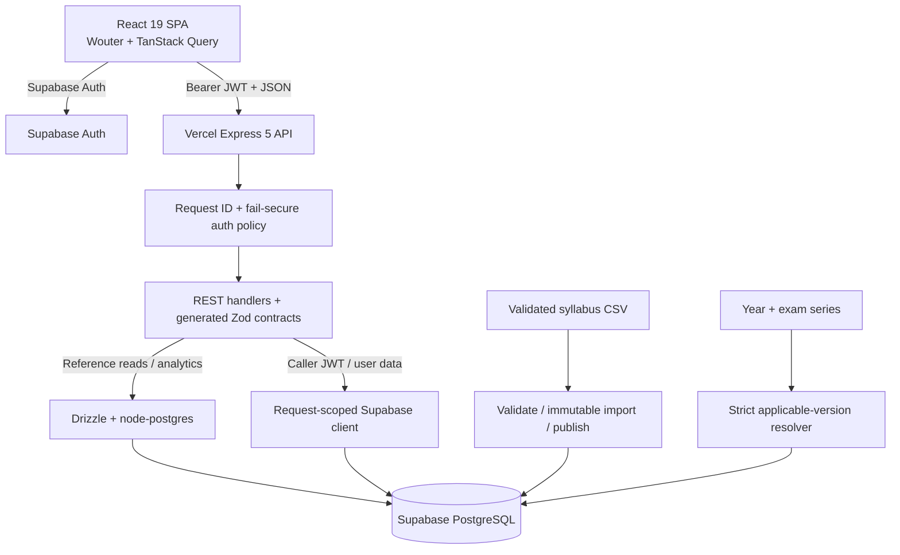
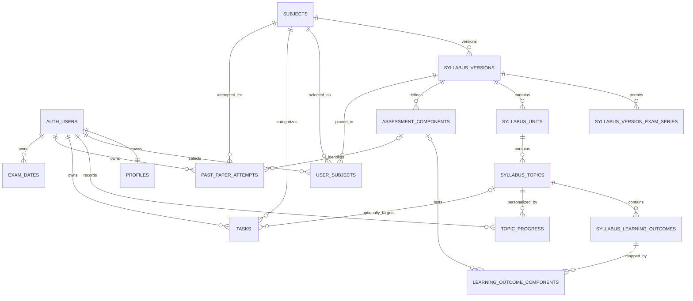

Checkpoint ID: 2026-08-30_1339
Generated At: 2026-08-30 13:39
Document Type: Architecture
Repository Branch: main
Commit SHA: 707e9793506fe5707d1cd836f500b8d4bbc0c990
Scope: Post-Phase 6 application, authentication, versioned reference-data, security, and paper architecture
Status: Repository Snapshot

# Technical Architecture

## Application Architecture



The browser obtains a Supabase session and sends its access token through the generated API client. Express applies an exact public/optional exception list and protects everything else by default. Route handlers use Drizzle for shared/reference queries and a caller-token Supabase client where RLS should remain authoritative for user-owned rows.

Reference data is version-scoped. Catalogue reads for non-members use the one administrative DEFAULT version. Authenticated members use their stored `user_subjects.syllabus_version_id`, including retired/archived historical versions; a draft or broken pin fails as an invariant. New assignments resolve by declared exam year/series rather than DEFAULT.

## Repository Structure

| Path | Purpose |
| --- | --- |
| `artifacts/revision-platform/` | Deployed React SPA, pages, auth provider, query/cache state, and frontend tests. |
| `artifacts/api-server/` | Express API, Vercel/standalone entry points, auth middleware, routes, and tests. |
| `artifacts/mockup-sandbox/` | Non-production design/component sandbox. |
| `lib/api-spec/` | OpenAPI source and Orval configuration. |
| `lib/api-zod/` | Generated server validation/contracts. |
| `lib/api-client-react/` | Generated frontend client/hooks and authenticated fetch. |
| `lib/db/` | Drizzle schema, runtime pool, 16 migrations, migration journal, and bootstrap SQL. |
| `scripts/src/syllabus/` | CSV parser/normalizer, hashing, immutable import, adoption, publication, and applicability operations. |
| `scripts/src/db-harness/` | Dedicated loopback-only disposable Supabase migration/integration/lifecycle harness. |
| `data/syllabi/raw/` | Nine validated CSVs and tracked audit report. |
| `supabase/` | Ordinary local Supabase service configuration, not application migration history. |
| `docs/reference-data/syllabus-applicability/` | Research, write-set, and future revision runbook. |
| `docs/cursor/reports/` | Detailed phase implementation, hosted apply, QA, and deployment evidence. |

## Authentication Architecture

1. The browser client uses only `VITE_SUPABASE_URL` and `VITE_SUPABASE_PUBLISHABLE_KEY`; no server secret is exposed through `VITE_*`.
2. `AuthProvider` persists/refreshes Supabase sessions, resolves `/api/profile`, handles auth changes, and clears obsolete mock/local-storage auth keys.
3. The generated API client attaches the current bearer token and performs account-boundary query-cache cleanup on an authoritative 401.
4. Express's global policy exposes only health, catalogue, assignment-session, subject, and optional syllabus/component reads. New/unclassified routes require auth.
5. `requireAuth` verifies the token with Supabase `auth.getClaims()`, validates `sub` as a UUID, and stores request-scoped user ID/access token.
6. `profiles.id` is one-to-one with `auth.users.id`. A migration-owned trigger creates profiles; restricted security-definer RPCs perform atomic onboarding and subject replacement.
7. Clients submit subject IDs and structured sessions, never `syllabusVersionId`. Database functions derive the authenticated user through `auth.uid()` and resolve version pins server-side.

There is no active mock authentication system. Google sign-in is UI-feature-flagged and requires hosted provider configuration.

## Database Architecture

### Shared Reference Data

| Table | Current role |
| --- | --- |
| `subjects` | Canonical name, four-digit Cambridge code, and display color. |
| `syllabus_versions` | Subject-scoped immutable graph identity, lifecycle, hash, DEFAULT flag, provenance, and applicability range. |
| `syllabus_version_exam_series` | Per-version product assignment permission for Feb/Mar, May/June, and Oct/Nov. |
| `syllabus_units` | Ordered main topics belonging to one version. |
| `syllabus_topics` | Ordered subtopics under a unit; no user status/notes. |
| `syllabus_learning_outcomes` | Ordered normalized outcome text under a topic. |
| `assessment_components` | Version-scoped paper code/level/name/duration/marks/weighting. |
| `learning_outcome_components` | Outcome/component/level occurrence junction. |

`syllabus_versions.lifecycle` is `draft`, `published`, `retired`, or `archived`. `logical_revision_key` follows `{subjectCode}-rNNN` operationally. `content_sha256` fingerprints the canonical graph. Published/retired/archived immutability is enforced by importer behavior rather than a database trigger.

Applicability is stored as complete from/to year+series fields plus a generated integer range. Published windows for the same subject cannot overlap. Exactly one DEFAULT is permitted per subject and DEFAULT must be published.

### User-Owned Data

| Table | Ownership/model |
| --- | --- |
| `profiles` | Auth UUID primary key; name, username, level, display exam session, onboarding timestamps. |
| `user_subjects` | `(user_id, subject_id)` membership; immutable pin plus structured intended year/series. |
| `topic_progress` | `(user_id, topic_id)` status and notes overlay. |
| `tasks` | User-owned subject task with optional pinned-version topic. |
| `past_paper_attempts` | User-owned component/variant/series/year score record. |
| `exam_dates` | User-owned subject/paper label and date. |

## Relationships



Important constraints include the composite membership subject/version foreign key, complete intended-session pairs, four-digit intended years, one DEFAULT per subject, logical revision uniqueness per subject, complete/non-overlapping published applicability, component natural keys, ordered hierarchy natural keys, per-user topic uniqueness, bounded notes/statuses, and past-paper score/year/variant checks.

## Data Ownership Model

Shared canonical syllabus graphs are imported once and reused. They contain no individual completion state. Lifecycle, applicability, series policy, and DEFAULT are operator-owned metadata.

Individual user state is keyed by the authenticated UUID. A membership pins the user to one version and records the intended exam session used for assignment. Progress overlays shared topics. Tasks and attempts may reference only the caller's pinned graph. Existing pins remain stable across new publications and DEFAULT changes.

```text
Non-member reference read -> subject DEFAULT
Member reference read     -> stored membership pin
New membership            -> strict session resolver
Retained membership       -> existing pin and stored session
```

## Security Architecture

- Client environment: only Supabase URL and publishable key. `SUPABASE_SERVICE_ROLE_KEY`, database URLs, and migration credentials are server/tooling-only.
- API boundary: fail-secure global route classification; user ID is derived from verified claims, never request ownership fields.
- RLS: enabled on profiles, memberships, progress, tasks, attempts, and exam dates. Ownership policies use `auth.uid()` and table-specific privileges.
- Restricted writes: membership replacement, onboarding, and progress mutations use reviewed functions. Security-definer functions set an empty search path, check `auth.uid()`, and have explicit revokes/grants.
- Internal policy table: `syllabus_version_exam_series` has RLS enabled and no direct `PUBLIC`, `anon`, or `authenticated` access. The resolver is not granted directly to browser roles; assignment RPCs call it internally.
- Reference write safety: topic, task-topic, and component mutations compare the referenced row's version with the caller's membership pin.
- Ambiguity safety: zero or multiple applicable versions fail closed; ambiguous public session projections are omitted.
- Migration safety: application DDL is Drizzle-owned. The disposable harness accepts only its dedicated loopback ports and explicit destructive authorization, rejects inherited/hosted URLs, migrates empty-to-head, and cleans up.
- Runtime connection safety: full database URLs are redacted from errors; serverless session pooling is rejected in favor of transaction pooling.

Repository migrations verify these controls, but this checkpoint did not independently introspect hosted grants/policies. Hosted-state claims come from the Phase 6 closeout evidence.

## Syllabus Assignment Architecture

The public assignment-session endpoint joins published versions, applicability windows, and version-series policy. It projects only future May/June/Oct/Nov choices with exactly one candidate. Version IDs remain internal.

```text
Client: subject + intended year + intended series
  -> onboarding/replacement RPC
  -> lockdin_membership_session_from_request
  -> lockdin_resolve_applicable_syllabus_version
  -> exactly one published + applicable + product-enabled version
  -> user_subjects pin + intended session
```

Settings may retain an existing subject without re-supplying a session. Adding a subject requires a complete session. Removing and re-adding is a new assignment. There is no automatic repin and no UI version control.

## Past-Paper Architecture

Paper identity remains atomized:

| Dimension | Storage |
| --- | --- |
| Subject | `past_paper_attempts.subject_id` |
| Component | `component_id` to a version-scoped assessment component |
| Base paper code | `assessment_components.paper_code`, e.g. `9702/4` |
| Variant | Attempt integer `1`-`5` or null |
| Session | `May/June`, `Oct/Nov`, `Feb/Mar`, or `Specimen` |
| Year/attempt | Four-digit paper year plus score, marks, percentage, date, optional time/notes |

For a Physics component with base code `9702/4` and variant `2`, the API/UI derives `9702/42`; that combined string is not the primary database identity. Creation validates that the component belongs to the subject and the caller's pinned syllabus version. Percentage is calculated server-side. List/create/delete exist; update does not.
