Checkpoint ID: 2026-08-30_1339
Generated At: 2026-08-30 13:39
Document Type: Data Pipeline
Repository Branch: main
Commit SHA: 707e9793506fe5707d1cd836f500b8d4bbc0c990
Scope: Current syllabus source, validation, immutable ingestion, applicability, publication, and runtime delivery
Status: Repository Snapshot

# Reference Data Pipeline

```text
Official Cambridge syllabus material
  -> extracted repository CSV snapshot
  -> Python semantic audit + tracked report
  -> TypeScript parse / validate / normalize
  -> canonical graph SHA-256
  -> immutable logical revision draft
  -> applicability + series-policy research/write-set
  -> publish under reviewed owner authorization
  -> Supabase PostgreSQL shared reference graph
  -> pin-aware Express API
  -> React syllabus/progress/paper UI
```

The repository starts at extracted CSVs; the importer does not itself retrieve official PDFs. Provenance research for applicability lives under `docs/reference-data/syllabus-applicability/` and is separate from the raw import manifest.

## Source Data

Source directory: `data/syllabi/raw/`

Filename convention: `<four-digit-subject-code>_<snake_case_subject>.csv`

| File | Rows | Units | Topics | Outcomes | Components | Relationships |
| --- | ---: | ---: | ---: | ---: | ---: | ---: |
| `9231_further_mathematics.csv` | 142 | 4 | 24 | 84 | 7 | 142 |
| `9489_history.csv` | 659 | 21 | 81 | 659 | 4 | 659 |
| `9609_business.csv` | 690 | 5 | 34 | 345 | 4 | 690 |
| `9618_computer_science.csv` | 366 | 19 | 45 | 366 | 4 | 366 |
| `9700_biology.csv` | 900 | 22 | 62 | 405 | 8 | 900 |
| `9701_chemistry.csv` | 798 | 25 | 104 | 554 | 5 | 798 |
| `9702_physics.csv` | 518 | 27 | 81 | 373 | 5 | 518 |
| `9708_economics.csv` | 518 | 7 | 51 | 259 | 4 | 518 |
| `9709_mathematics.csv` | 226 | 6 | 38 | 153 | 9 | 226 |
| **Total** | **4,817** | **136** | **520** | **3,198** | **50** | **4,817** |

The checkpoint validation command produced these counts with zero warnings. `_audit_report.json` reports PASS and zero CRITICAL/HIGH/MEDIUM/LOW findings for every CSV. Its informational observations are expected duplicate/component-level and ordering review signals.

`docs/audit_syllabi_v2.py` is the standalone semantic audit. It rewrites `_audit_report.json`; it is not a read-only checkpoint command even though it does not rewrite CSVs.

## CSV Schema

Every manifest file currently has this exact ordered header:

```text
Main Topic
Subtopic
Learning Outcome
Subject
Exam Board
Qualification
Level
Component Name
Paper Code
Duration (min)
Total Marks
Weighting (%)
```

The parser checks header order, row width, UTF-8 replacement characters, required values, numeric fields, allowed levels, subject/file consistency, and contradictory component metadata. Paper codes, when present, follow base form `####/#`.

## CSV -> Database Mapping

| CSV field | Database destination | Current transformation |
| --- | --- | --- |
| Main Topic | `syllabus_units.title`, `order_index` | One ordered unit per distinct title inside the revision graph. |
| Subtopic | `syllabus_topics.title`, `order_index` | Distinct under its unit; first occurrence order retained. |
| Learning Outcome | `syllabus_learning_outcomes.outcome`, `order_index` | Repeated text under one topic is normalized once. |
| Subject | Validation/diagnostic | Manifest supplies canonical subject identity/name/color; mismatches produce notices/errors as defined by parser rules. |
| Exam Board | `syllabus_versions.exam_board` | File-consistent value stored on the version. |
| Qualification | `syllabus_versions.qualification` | File-consistent value stored on the version. |
| Level | `assessment_components.level`, `learning_outcome_components.level` | Part of component identity and preserved for componentless rows. |
| Component Name | `assessment_components.component_name` | Stored per version/paper-code/level component. |
| Paper Code | `assessment_components.paper_code` | Stored as base code such as `9702/4`; variant is not part of reference ingestion. |
| Duration (min) | `assessment_components.duration_minutes` | Integer or null. |
| Total Marks | `assessment_components.total_marks` | Integer or null. |
| Weighting (%) | `assessment_components.weighting_percent` | Numeric/real or null. |
| Row occurrence | `learning_outcome_components` | Outcome-to-component/level link; component may be null. |
| Manifest subject code | `subjects.code` | Canonical subject key. |
| Manifest filename | `syllabus_versions.source_file` | Last-seen provenance, not logical identity. |
| CLI `--revision` | `syllabus_versions.logical_revision_key` | Required for real import/adopt/publish; convention `{code}-rNNN`. |
| Canonical normalized graph | `syllabus_versions.content_sha256` | Deterministic SHA-256 used to detect identity/content mismatch. |
| Applicability write-set | version `applicable_*` + `syllabus_version_exam_series` | Complete window plus Feb/Mar/May-June/Oct-Nov product policy. |

The legacy manifest's `validFrom`/`validTo` remain null and its `versionLabel` remains `Current syllabus`; structured assignment uses the newer `applicable_*` fields and logical revision identity.

## Import Process

These commands exist in current package scripts. They are shown for verified operation, not as authorization to write hosted data.

### Semantic audit (rewrites tracked report)

```bash
python docs/audit_syllabi_v2.py data/syllabi/raw
```

### Offline validation

```bash
pnpm --filter @workspace/scripts syllabus:validate
```

Validation and import dry-run now avoid loading the database importer. This checkpoint verified all nine files without `DATABASE_URL`. On this Windows host the pnpm/Git-Bash wrapper hit `Win32 error 5`; the pinned `tsx` entry point ran successfully once subprocess permission was available.

### Future revision dry run

```bash
pnpm --filter @workspace/scripts syllabus:import --dry-run --files=9702 --revision=9702-r002 --csv=<path-to-successor.csv>
```

`--csv` is optional and overrides the raw manifest path. Although the CLI permits broader dry-run validation, a real revision workflow should use one explicit subject and logical revision.

### Immutable draft import

```bash
pnpm --filter @workspace/scripts syllabus:import --files=9702 --revision=9702-r002 --csv=<path-to-successor.csv>
```

Real import requires exactly one known `--files=<subject-code>` and an explicit nonblank `--revision`. It creates or rebuilds a draft. It never overwrites a published, retired, or archived graph with different content.

### Legacy identity adoption

```bash
pnpm --filter @workspace/scripts syllabus:adopt --files=9702 --revision=9702-r001
```

Adoption is only for a single identity-null published legacy snapshot. It loads the database graph, hashes it, compares it to normalized source, and refuses ambiguous or mismatched candidates. Hosted closeout evidence records all nine real graphs as already adopted to `r001`.

### Applicability validation/apply

```bash
pnpm --filter @workspace/scripts syllabus:applicability
pnpm --filter @workspace/scripts syllabus:applicability --mode=apply
```

The default manifest is constrained to exactly nine unique `{code}-r001` entries with expected hashes. Validation checks database identity/hash/state without writing. Apply populates previously null windows and three series-policy rows per version; mismatched/non-null conflicting state fails. Hosted apply needs separate owner authorization.

### Publish a draft

```bash
pnpm --filter @workspace/scripts syllabus:publish --files=9702 --revision=9702-r002
pnpm --filter @workspace/scripts syllabus:publish --files=9702 --revision=9702-r002 --make-default --retire-revision=9702-r001
```

Publication re-hashes the stored graph, requires a nonempty draft, checks overlap/default invariants, and can retire a named conflicting published revision. It publishes drafts only. Promoting an already-published successor to DEFAULT is intentionally an explicit owner admin action, not a CLI operation.

### Migration and verification commands

```bash
pnpm --filter @workspace/db migrate
pnpm run check:migrations
pnpm --filter @workspace/scripts test:harness
pnpm --filter @workspace/scripts db-harness
```

`migrate` applies the Drizzle journal to the configured target. `check:migrations` is read-only integrity validation. `test:harness` tests safety/integrity logic without starting a database. `db-harness` is destructive only against the dedicated authorized loopback Supabase fixture and must not receive a hosted URL.

## Import Safety

- Parse/validation completes before a selected graph is written.
- A canonical normalized graph hash separates content identity from filenames.
- Real import requires an explicit logical revision key and one subject.
- Subject-scoped advisory transaction locks serialize revision operations.
- A new key creates a non-default draft and a complete graph in one transaction.
- Re-running identical content returns `already-imported`; a source filename-only change may update provenance.
- A changed draft is rebuilt transactionally. Terminal graphs (`published`, `retired`, `archived`) reject content mismatch and require a new key.
- Legacy adoption is hash-verified and refuses multiple candidates or an altered graph.
- Publication recomputes the database graph hash and rejects empty, mismatched, ambiguous-null, or overlapping publication states.
- Database constraints prevent overlapping non-null published applicability windows and multiple DEFAULT versions per subject.
- Applicability and product series policy are independent; false or absent policy fails closed.
- The importer does not mutate user memberships, progress, tasks, attempts, or exam dates.
- Existing membership pins are preserved; DEFAULT changes do not repin.
- The dedicated disposable harness verifies empty-to-head migrations, lifecycle behavior, strict assignment, auth/RLS/HTTP behavior, and cleanup on loopback-only ports.

## Runtime Data Flow

```mermaid
flowchart LR
    Catalogue[Public subject catalogue] --> Choice[Public safe assignment sessions]
    Choice --> Submit[Subject IDs + year/series + overrides]
    Submit --> RPC[Onboarding / replacement RPC]
    RPC --> Resolve[Strict published/applicable/policy resolver]
    Resolve --> Membership[user_subjects pin + intended session]
    Membership --> Reference[Pin-aware syllabus/components]
    Reference --> Overlay[User progress/tasks/attempts]
    Overlay --> UI[Revision UI]
```



- Anonymous/non-member syllabus reads resolve the subject DEFAULT.
- Authenticated members resolve the stored pin, not DEFAULT.
- New subject assignment requires a complete structured session and exactly one applicable product-enabled graph.
- Retained settings memberships keep their existing pin/session and may omit new session input.
- Progress/task/component writes must target reference rows on the caller's pin.
- The public assignment-session response exposes safe labels and dates, not internal version IDs.

## Current Pipeline Status

| Stage | Status | Evidence |
| --- | --- | --- |
| Raw CSV snapshots | IMPLEMENTED | Nine tracked files, unchanged since the previous checkpoint. |
| Semantic audit | IMPLEMENTED | All nine PASS; report contains informational findings only. |
| Offline TypeScript validation | IMPLEMENTED | 4,817 rows validated with `Overall: OK` in this checkpoint. |
| Logical revision hashing | IMPLEMENTED | Deterministic content SHA-256 for every normalized graph. |
| Immutable draft import | IMPLEMENTED | Create/rebuild draft; terminal content mismatch fails. |
| Legacy adoption | IMPLEMENTED | Hash-verified identity-null published snapshot adoption. |
| Applicability/policy population | IMPLEMENTED | Repository write-set and operator; hosted closeout records 9 windows/27 rows. |
| Publication | IMPLEMENTED | Draft-only publish with hash/overlap/default checks. |
| Already-published DEFAULT promotion | PARTIALLY IMPLEMENTED | Explicit owner admin SQL step only. |
| Real successor graph | NOT IMPLEMENTED | No real `r002` exists. |
| Automatic repin | NOT IMPLEMENTED | Deliberately excluded. |

Documentation discrepancy: `docs/reference-data/syllabus-applicability/README.md` still says the write-set is not applied, while later report 112 records the hosted population and verification. The later evidence is current; the README should be corrected in a future documentation update.
