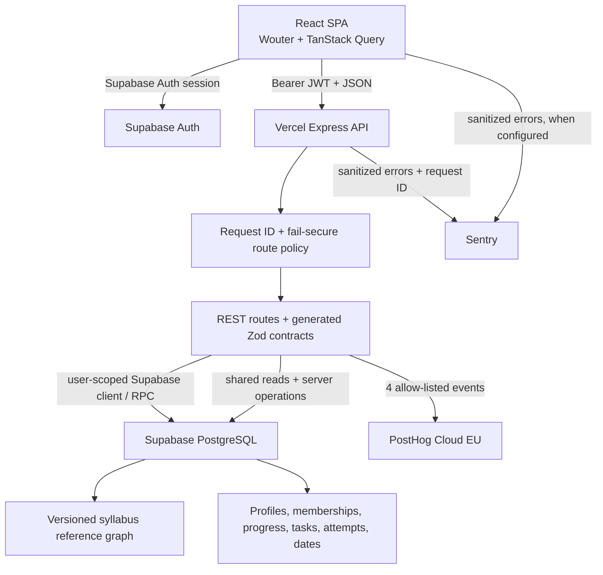
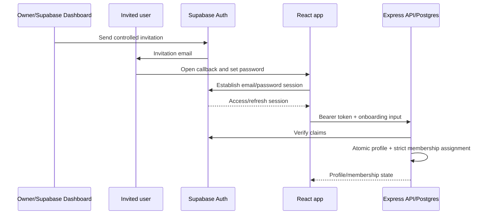
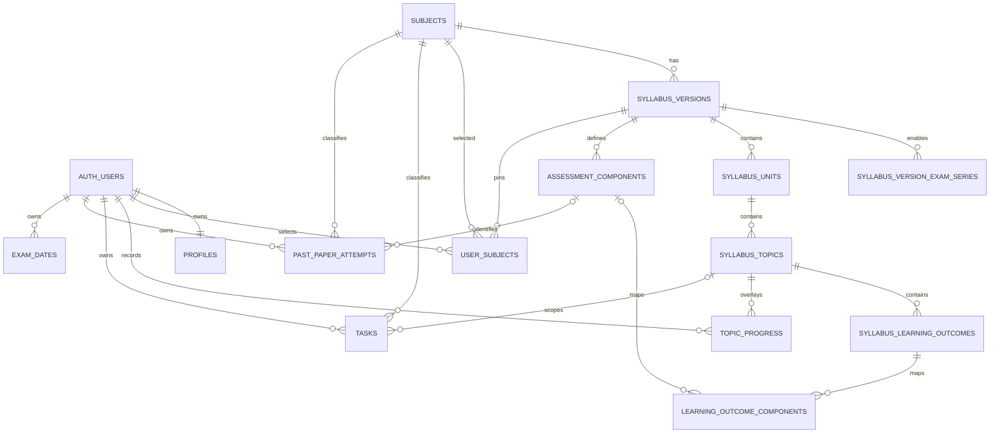

Checkpoint ID: 2026-09-01_2245
Generated At: 2026-09-01 22:45
Document Type: Architecture
Repository Branch: main
Commit SHA: 0d2963c854ad3fbf9ce0e111c695138120fd42e5
Scope: Current application, authentication, data ownership, strict assignment, telemetry, and past-paper architecture
Status: Repository Snapshot

# Technical Architecture

## Application Architecture



The browser owns navigation and view state but not authorization. Supabase provides identity/session tokens. The Express API verifies authenticated requests, derives the caller from the token, validates OpenAPI-generated inputs, and accesses PostgreSQL through Drizzle, an authenticated Supabase client, or reviewed database functions. Shared reference data is versioned independently from user overlays.

## Repository Structure

| Path | Responsibility |
| --- | --- |
| `artifacts/revision-platform/` | Production React SPA, pages, auth provider, API consumers, analytics handoff, Sentry frontend integration |
| `artifacts/api-server/` | Express API, auth policy, routes, assignment logic, analytics, monitoring, serverless build |
| `lib/api-spec/` | OpenAPI source and Orval configuration |
| `lib/api-client-react/` | Generated React client and authenticated fetch wrapper |
| `lib/api-zod/` | Generated runtime request/response schemas |
| `lib/db/` | Drizzle schema, connection handling, 16 authoritative migrations |
| `scripts/src/syllabus/` | CSV parse/normalize/hash/import/adopt/publish/applicability tooling |
| `scripts/src/db-harness/` | Loopback-only disposable database and HTTP integration harness |
| `data/syllabi/raw/` | Nine validated source CSVs plus semantic audit report |
| `docs/reference-data/` | Applicability research, authorized historical write-set, future-revision runbook |
| `docs/cursor/reports/` | Incremental implementation/hosted evidence; later closeouts supersede earlier reports |
| `docs/beta/` | Draft operational beta materials; not proof of beta start |
| `supabase/config.toml` | Local Supabase configuration only; not hosted configuration authority |

`artifacts/mockup-sandbox/` is a separate prototype/reference workspace, not the Production application entry point.

## Frontend Architecture

`App.tsx` mounts public routes (`/`, `/login`, `/signup`, recovery/callback, `/privacy`, `/terms`) and authenticated routes (`/onboarding`, `/dashboard`, `/subjects`, `/subjects/:id`, `/study-plan`, `/past-papers`, `/progress`, `/calendar`, `/settings`). `AuthProvider` owns Supabase session observation and profile hydration. `RequireAuth` protects application routes. TanStack Query caches server state and mutation handlers invalidate affected queries.

The public `/signup` route contains no registration form during the controlled-beta posture. `AuthProvider.signUp` and Google OAuth code remain for non-page/future use, but hosted public signup and OAuth are disabled. This is preparation, not enabled functionality.

## Backend / API Architecture

The Vercel rewrite sends `/api/*` to the bundled Express handler. Middleware order is:

1. Pino request logging with query-stripped URL.
2. UUID request ID generation/response header.
3. CORS and body parsing.
4. Global fail-secure route policy.
5. REST router.
6. Central error handler with optional Sentry capture.

Public API routes are explicitly classified; other application routes require a verified Supabase bearer token. Ownership is never accepted from a request body. The OpenAPI source generates both browser clients and Zod validators; generated code should be regenerated, not hand-edited.

## Authentication Architecture



- Provider: hosted Supabase Auth.
- Hosted posture: public signup OFF, email/password ON, confirmation ON, anonymous/OAuth/CAPTCHA OFF.
- Profile relationship: `profiles.id` is 1:1 with `auth.users.id`; `lockdin_on_auth_user_created` creates a nullable initial profile.
- Display name: `profile.full_name`, Auth `user_metadata.full_name`, then `Scholar` fallback.
- Username: nullable before onboarding, then required by current onboarding, lowercase `[a-z0-9_]{3,24}`, unique when non-null.
- Session handling: browser `getSession()` plus `onAuthStateChange`; API uses verified token claims and never trusts client user IDs.
- Recovery: canonical `/update-password` redirect is configured. Delivery/path passed; the tested one-time action expired and password completion is not claimed.
- Legacy/prepared paths: email signup and Google OAuth methods remain in `AuthProvider`, but public UI/hosted settings prevent them in the current beta posture.

## Database Architecture

### Shared Reference Data

| Table | Purpose |
| --- | --- |
| `subjects` | Stable subject code/name/colour catalogue |
| `syllabus_versions` | Version identity, lifecycle, content hash, DEFAULT flag, applicability window |
| `syllabus_version_exam_series` | Per-version series policy and automatic-assignment enablement |
| `syllabus_units` | Ordered main-topic groups within a version |
| `syllabus_topics` | Ordered subtopics; denormalized subject ID for query convenience |
| `syllabus_learning_outcomes` | Ordered canonical learning outcomes under a topic |
| `assessment_components` | Version/level-specific base paper definitions and marks/duration/weighting |
| `learning_outcome_components` | Outcome-to-component/level occurrence mapping |

### User-Owned Data

| Table | Purpose / ownership |
| --- | --- |
| `profiles` | 1:1 Auth profile, full name, username, level, profile exam-session label |
| `user_subjects` | User/subject membership, immutable version pin, per-subject intended session |
| `topic_progress` | User/topic status and note overlay |
| `tasks` | User revision tasks with optional subject/topic links |
| `past_paper_attempts` | User attempt facts: component, variant, session/year, score, date, notes |
| `exam_dates` | User subject/date/label records |

### Relationships



`user_subjects` has a composite foreign key `(subject_id, syllabus_version_id)` to prevent a user being pinned to another subject's graph.

## Syllabus Assignment Architecture

New memberships do not accept a syllabus version ID from the client. Onboarding/settings send a global structured `{year, series}` and optional per-subject overrides. Database functions select the effective session per subject and call `lockdin_resolve_applicable_syllabus_version`.

The resolver requires exactly one row satisfying all of:

- matching subject;
- `lifecycle='published'`;
- requested session inside the structured applicability range;
- matching `syllabus_version_exam_series` row with `product_auto_assign=true`.

May/June and Oct/Nov are exposed. Feb/Mar is schema-valid but product-disabled/deferred. A zero/ambiguous match fails closed. Retained memberships preserve both the syllabus pin and their intended session; removals delete membership state, and additions resolve only the new rows. `profiles.exam_session` does not drive this resolver. No background or DEFAULT-triggered repin exists.

## Data Ownership Model

The syllabus graph is shared canonical reference data and contains no user identity. A membership points one user to one immutable version. Progress, tasks, paper attempts, dates, profile fields, and intended sessions remain individual user data. Shared reference imports must never rewrite user overlays or membership pins.

## Security Architecture

- RLS is enabled on user-owned tables; ownership predicates use `auth.uid()` and applicable UPDATE policies include `WITH CHECK`.
- Direct table privileges are revoked and narrowly re-granted. `user_subjects` is read-only directly; reviewed security-definer functions own replacement/onboarding writes.
- Security-definer functions derive the user exclusively from `auth.uid()`, set a controlled search path, validate membership/version relationships, and have `PUBLIC`/`anon` execute revoked before narrow grants.
- The internal series-policy table has RLS and no direct browser role access.
- Browser code receives only Supabase publishable configuration and the browser-safe Sentry DSN. Database URLs, analytics alias secret, Sentry build token, and any service-role key are server-only.
- API logging removes query strings and does not log auth headers/bodies. Telemetry sanitizers reject arbitrary study/error text.
- Local `supabase/config.toml` is development configuration. Hosted Auth state is evidenced by later reports, not inferred from the local file.

The database exposes shared reference reads through the API; this checkpoint did not independently query current hosted grants. Restore proof is the latest tracked hosted structural evidence.

## Analytics Architecture

Only the API initializes `posthog-node`. After successful product writes, route handlers call a four-event allow-list. The distinct ID is `lockdin_ph_` plus an HMAC-SHA256 derived from the verified Supabase UUID and a server secret. `account_created` also receives a deterministic retry UUID. Events carry `environment`; onboarding may carry bounded `subject_count`. Unknown names/properties are dropped. `$process_person_profile=false`, GeoIP disabled, exception autocapture disabled, 800 ms delivery budget, and failure is a no-op.

The frontend stores a local pending-signup marker and makes an authenticated, empty-body call to `/api/analytics/account-created`; the API still derives the identity. There is no browser PostHog SDK or `identify()`.

## Error Monitoring Architecture

React dynamically initializes `@sentry/react` when `VITE_SENTRY_DSN` is present and captures route-boundary/uncaught errors once. Express initializes `@sentry/node` when `SENTRY_DSN` is present and captures in the central error handler. Both use allow-list sanitizers, environment/release tags, no default PII, zero trace/profile sample rates, and no Replay. API capture can include the existing request ID.

Vite/esbuild upload private source maps only when build-only `SENTRY_AUTH_TOKEN`, `SENTRY_ORG`, `SENTRY_PROJECT`, and a release SHA exist. Public maps are not deployed. Direct `@opentelemetry/core`, `instrumentation`, and `sdk-trace-base` dependencies are required by the externalized Vercel runtime graph even though Sentry auto-instrumentation is disabled.

## Past-Paper Architecture

The primary attempt representation is atomized across references and attempt fields:

```text
subject_id     -> subjects.code, e.g. 9702
component_id   -> assessment_components.paper_code, e.g. 9702/4
variant        -> integer 1..5 or null, e.g. 2
session        -> May/June | Oct/Nov | Feb/Mar | Specimen
year           -> four-digit paper year
attempt facts  -> score, total_marks, percentage, date, time, notes
```

For Physics subject `9702`, component row `9702/4`, and variant `2`, the API derives `9702/42`; it then adds session and year for a label such as `9702/42 — May/June 2026`. The combined attempted paper code/label is not the primary database identity and is not stored. The base `paper_code` is stored on the shared assessment component, so the implementation is atomized at the shared component reference plus attempt variant/session/year boundary, not into a standalone numeric `component=4` column.

Attempt ownership comes from the authenticated caller. The API verifies that the component belongs to the subject's pinned/reference syllabus context. The UI clears stale component/variant/session choices when the selected subject changes.

## Deployment Architecture

Vercel builds the API bundle first, then the Vite SPA. `/api/*` rewrites to the Express function and all other paths to `index.html`. The canonical hosted URL is `https://lockdinapp-web.vercel.app`; no official custom web-domain cutover is evidenced. Supabase Auth Site URL and two exact redirects use this host. Basic robots/Open Graph/Twitter metadata exists, but a custom-domain canonical strategy and production email-sender proof do not.
