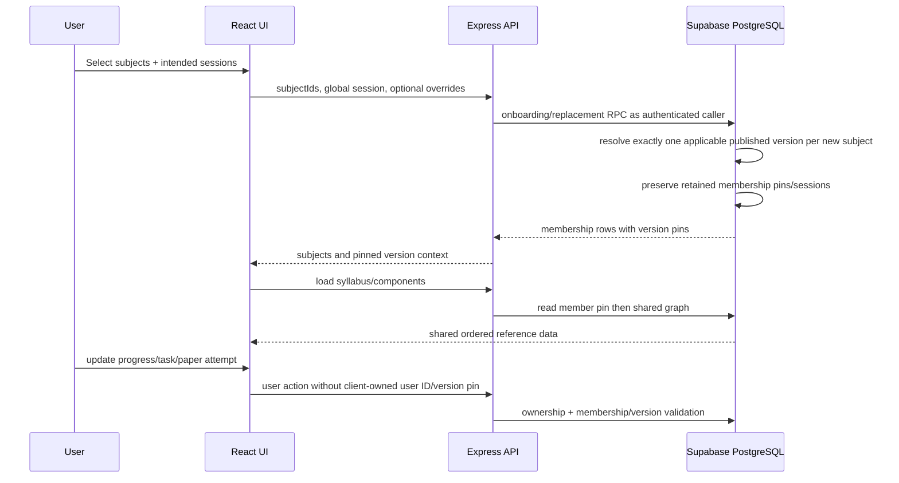

Checkpoint ID: 2026-09-01_2245
Generated At: 2026-09-01 22:45
Document Type: Data Pipeline
Repository Branch: main
Commit SHA: 0d2963c854ad3fbf9ce0e111c695138120fd42e5
Scope: Current syllabus/reference-data validation, normalization, immutable import, publication, assignment, and runtime flow
Status: Repository Snapshot

# Reference Data Pipeline


The repository CSVs are the source inputs for shared syllabus graphs. Drizzle migrations are schema authority. Import/applicability operations are separate from migrations and require explicit operator intent; they do not authorize user-data changes.

## Source Data

Source directory: `data/syllabi/raw/`

| File | Rows | Units | Topics | Outcomes | Components | Relationships |
| --- | ---: | ---: | ---: | ---: | ---: | ---: |
| `9231_further_mathematics.csv` | 142 | 4 | 24 | 84 | 7 | 142 |
| `9489_history.csv` | 659 | 21 | 81 | 659 | 4 | 659 |
| `9609_business.csv` | 690 | 5 | 34 | 345 | 4 | 690 |
| `9618_computer_science.csv` | 366 | 19 | 45 | 366 | 4 | 366 |
| `9700_biology.csv` | 900 | 22 | 62 | 405 | 8 | 900 |
| `9701_chemistry.csv` | 798 | 25 | 104 | 554 | 5 | 798 |
| `9702_physics.csv` | 518 | 27 | 81 | 373 | 5 | 518 |
| `9708_economics.csv` | 518 | 7 | 51 | 259 | 4 | 518 |
| `9709_mathematics.csv` | 226 | 6 | 38 | 153 | 9 | 226 |

Total: 4,817 CSV rows, 136 units, 520 topics, 3,198 distinct outcomes, 50 assessment components, and 4,817 outcome/component-level relationships.

Naming convention is `<subject-code>_<snake_case_subject>.csv`. The manifest in `scripts/src/syllabus/manifest.ts` fixes subject code/name/colour and file selection. `_audit_report.json` is the tracked semantic audit. All nine files currently have PASS with no CRITICAL/HIGH/MEDIUM/LOW findings; informational observations are retained.

Applicability evidence is stored under `docs/reference-data/syllabus-applicability/`:

- `current-version-research.json`: official-source provenance and content-family reasoning.
- `population-manifest.json`: the exact nine-version write-set used in Phase 6, with expected hashes and series policy.
- `future-syllabus-revision-runbook.md`: reviewed successor-revision workflow.

These files are evidence/operator inputs, not standing authorization to repeat hosted writes. There is no Information Technology CSV or manifest entry.

## CSV Schema

The parser requires these exact headers in this order-independent set:

```text
Main Topic
Subtopic
Learning Outcome
Subject
Exam Board
Qualification
Level
Component Name
Paper Code
Duration (min)
Total Marks
Weighting (%)
```

Allowed levels are `AS Level`, `A Level`, and `AS & A Level`. Paper codes normally match `####/#`. Metadata must be internally consistent for the same paper-code/level pair. Required text, numeric format/ranges, file-wide identity consistency, and duplicate contradictions are validated before normalization.

## CSV → Database Mapping

| CSV field | Database destination | Notes |
| --- | --- | --- |
| Main Topic | `syllabus_units.title` | First-seen order becomes `order_index`; version and subject links added. |
| Subtopic | `syllabus_topics.title` | Unique within a unit; first-seen order preserved. |
| Learning Outcome | `syllabus_learning_outcomes.outcome` | Deduplicated within a topic; first-seen order preserved. |
| Subject | Validation input | Checked for one value; manifest subject name supplies `subjects.name`. |
| Exam Board | `syllabus_versions.exam_board` | Must be consistent within the file. |
| Qualification | `syllabus_versions.qualification` | Must be consistent within the file. |
| Level | `assessment_components.level`; `learning_outcome_components.level` | Preserves AS/A-Level occurrence context. |
| Component Name | `assessment_components.component_name` | Part of version-specific component metadata. |
| Paper Code | `assessment_components.paper_code` | Base component code such as `9702/4`; natural key includes version and level. |
| Duration (min) | `assessment_components.duration_minutes` | Parsed integer or null where permitted. |
| Total Marks | `assessment_components.total_marks` | Parsed integer or null where permitted. |
| Weighting (%) | `assessment_components.weighting_percent` | Parsed numeric value; level-specific weightings may differ. |

Additional derived data:

- Manifest code/name/colour → `subjects`.
- Explicit operator revision key → `syllabus_versions.logical_revision_key`.
- Canonical normalized graph → `syllabus_versions.content_sha256`.
- Manifest/source metadata → label, valid-from/to and `source_file`.
- Row occurrence → `learning_outcome_components` link with component ID or null and level.
- Applicability manifest → structured version window plus three `syllabus_version_exam_series` rows.

## Import Process

These commands exist in current package scripts. They document capabilities; hosted writes still require explicit authorization and correct target verification.

### Semantic audit

```bash
python docs/audit_syllabi_v2.py data/syllabi/raw
```

This rewrites the tracked `_audit_report.json`; do not run casually during unrelated work.

### Offline validation

```bash
pnpm --filter @workspace/scripts syllabus:validate
```

This mode does not load the database importer. At this checkpoint it validated all nine files, 4,817 rows, expected hashes, and normalized counts with zero warnings.

### Future revision dry run

```bash
pnpm --filter @workspace/scripts syllabus:import --dry-run --files=9702 --revision=9702-r002 --csv=<path-to-successor.csv>
```

`--csv` is an optional explicit source override. Dry run parses, normalizes, hashes, and reports graph counts with zero database writes.

### Real draft import

```bash
pnpm --filter @workspace/scripts syllabus:import --files=9702 --revision=9702-r002 --csv=<path-to-successor.csv>
```

Real import requires exactly one known subject and one explicit nonblank logical revision key. It creates/rebuilds a draft only.

### Legacy identity adoption

```bash
pnpm --filter @workspace/scripts syllabus:adopt --files=9702 --revision=9702-r001
```

Adoption is restricted to a single identity-null terminal legacy snapshot whose database graph hash matches normalized source. Existing hosted graphs already have the established subject-prefixed `*-r001` identities according to Phase 6 evidence; this command is not a normal re-import step.

### Applicability validation and apply

```bash
pnpm --filter @workspace/scripts syllabus:applicability
pnpm --filter @workspace/scripts syllabus:applicability --mode=apply
```

Default mode is validation/read-only. Apply uses the reviewed nine-entry manifest, expected hashes, and May/June/Oct/Nov policy while keeping Feb/Mar disabled. Hosted apply is not authorized by the existence of this command.

### Publish a reviewed draft

```bash
pnpm --filter @workspace/scripts syllabus:publish --files=9702 --revision=9702-r002
pnpm --filter @workspace/scripts syllabus:publish --files=9702 --revision=9702-r002 --make-default --retire-revision=9702-r001
```

Publication re-hashes the stored graph and enforces lifecycle/default/applicability invariants. Changing DEFAULT on an already-published successor remains an explicit owner/admin operation, not an automatic repin mechanism.

### Re-import verification

Re-running the same real import command for the same draft key/content returns `already-imported`. A filename-only provenance change may return `provenance-updated`. A changed draft is rebuilt transactionally. A changed published/retired/archived graph fails and requires a new logical revision key.

### Migration / integrity commands

```bash
pnpm --filter @workspace/db migrate
pnpm run check:migrations
pnpm --filter @workspace/scripts test:harness
pnpm --filter @workspace/scripts db-harness
```

`migrate` writes the configured database and must use the reviewed Drizzle path. `check:migrations` and `test:harness` are non-destructive integrity/safety checks. `db-harness` is destructive only against its explicit loopback disposable fixture and rejects hosted targets.

Do not use `supabase db push` for the application schema. `DIRECT_DATABASE_URL` is preferred for migrations; runtime `DATABASE_URL` uses the supported transaction pooler. Environment values must never be recorded.

## Import Safety

- Validation occurs before any selected graph write.
- Canonical SHA-256 identifies normalized graph content independent of filename.
- Real import is single-subject, explicit-revision, and transactional.
- A subject-scoped advisory transaction lock serializes revision operations.
- New versions start as non-default drafts; draft graph insertion is all-or-nothing.
- Identical content is idempotent; provenance-only updates do not rebuild the graph.
- Changed drafts may be rebuilt; published/retired/archived graphs are immutable by importer contract.
- Legacy adoption refuses ambiguous candidates and content mismatch.
- Publication recomputes the database graph hash and rejects empty/mismatched/overlapping states.
- Database constraints allow only one DEFAULT per subject and prevent overlapping non-null published applicability windows.
- Applicability and series policy are separate; a missing/false policy fails assignment closed.
- First-seen order is stored at unit/topic/outcome/component levels.
- The importer does not mutate profiles, memberships, progress, tasks, attempts, or dates.
- DEFAULT changes do not repin existing memberships.
- Errors are reported per file/operation; transactions roll back partial graph work.

## Runtime Data Flow



Non-members may see DEFAULT catalogue/reference context. Members always use the stored pin. Topic/task/component writes must be compatible with that pin. Per-user progress is not embedded in the shared graph.

## Current Hosted Reference Evidence

The latest tracked restore proof records 9 subjects, 9 published versions, 136 units, 520 topics, 3,198 outcomes, 50 components, and 27 series-policy rows. It also proves 16/16 Drizzle migration hashes/timestamps. No real `r002` successor exists. The checkpoint did not query or write Production.

## Pipeline Limitations

1. Source CSVs are repository-curated extractions; official PDFs are provenance, not runtime inputs.
2. Current families end between 2028 and 2030 and require future edition research before expiry.
3. Feb/Mar product assignment is disabled even though the database enum supports it.
4. There is no approved Information Technology pipeline entry.
5. Promotion of an already-published non-default successor is intentionally not automated.
6. Import tooling cannot authorize hosted operations; target/owner authorization remains external.
