# Phase 5 Slice 4 — Mutation / Cache Entry Reconciliation

## Canonical baseline

- Repository: `ActifDevs/lockdinapp`
- Canonical branch: `main`
- Canonical baseline: `bb388c624f69fd9249f53c2cc3340024b10a2356`
- Application merge baseline: `b30bd578ade111493036158133d1383ac1127e25`
- Working tree: clean (`0` uncommitted changes)

## Prior slice handoff

- **Phase 5 Slice 1** (Account-Scoped Notification Preferences): CLOSED (Report 71)
- **Phase 5 Slice 2** (Read & Error-State Reconciliation): CLOSED (Report 74)
- **Phase 5 Slice 3** (UI / Navigation State Persistence): CLOSED (Report 77)

Slice 4 inherits authoritative URL-owned navigation state (Slice 3), localized read-state boundaries (Slice 2), and user-scoped storage (Slice 1).

## Current mutation inventory

Comprehensive audit of `@workspace/api-client-react` generated hooks and mounted application surfaces:

| Generated Hook | Endpoint | Mounted Surface | Operation Description |
| --- | --- | --- | --- |
| `useCreateTask` | `POST /api/tasks` | `src/pages/study-plan.tsx` | Create task via Add Task modal dialog |
| `useUpdateTask` | `PATCH /api/tasks/{taskId}` | `src/pages/study-plan.tsx` `src/pages/dashboard.tsx` `src/pages/subject-detail.tsx` | Toggle task completion across Study Plan, Dashboard Today's Mission, and Subject Detail Tasks |
| `useDeleteTask` | `DELETE /api/tasks/{taskId}` | `src/pages/study-plan.tsx` | Delete task from task list |
| `useUpdateSyllabusTopic` | `PATCH /api/syllabus/{topicId}` | `src/pages/subject-detail.tsx` | Cycle topic status (not_started / in_progress / completed); bulk complete/reset unit |
| `useCreatePastPaperAttempt` | `POST /api/past-papers/attempts` | `src/pages/past-papers.tsx` | Log past paper attempt via Log Paper modal dialog |
| `useDeletePastPaperAttempt` | `DELETE /api/past-papers/attempts/{id}` | `src/pages/past-papers.tsx` | Delete attempt row from attempt history |
| `useUpdateCurrentProfile` | `PATCH /api/users/profile` | `src/pages/settings.tsx` (via `useAuth().updateUser`) | Update user full name, level, exam session |
| `useReplaceCurrentUserSubjects` | `PUT /api/users/subjects` | `src/pages/settings.tsx` | Replace user subject memberships (1–5 subjects) |
| `useCompleteCurrentUserOnboarding` | `POST /api/users/onboarding` | `src/pages/onboarding.tsx` (via `useAuth().completeOnboarding`) | Initial user onboarding profile & subject selection |
| `useResetSyllabusTopicProgress` | `DELETE /api/syllabus/{topicId}/progress` | *None* | Unmounted / Out of scope |
| `useCreateExamDate` | `POST /api/exam-dates` | *None* | Unmounted / Out of scope |
| `useDeleteExamDate` | `DELETE /api/exam-dates/{id}` | *None* | Unmounted / Out of scope |
| `useCreateSubject` / `useDeleteSubject` | `/api/subjects` (Admin) | *None* | Unmounted / Out of scope |

## Mutation contract matrix

| Surface & Mutation | Hook | Pending UI | Duplicate Prevention | Success Feedback | Failure Feedback | Invalidation Scope | Classification |
| --- | --- | --- | --- | --- | --- | --- | --- |
| **Study Plan: Add Task** | `useCreateTask` | Button loading | Button disabled | Modal close, form reset, task list refresh | `actionError` rendered on page behind modal (dialog lacks inline alert) | `tasks`, `dashboard/summary`, `progress/overview` | **B — UX FEEDBACK GAP ONLY** |
| **Study Plan: Toggle Task** | `useUpdateTask` | Checkbox disabled | Row action disabled | Immediate UI update, list & summary refresh | Sets `actionError` alert on page | `tasks`, `dashboard/summary`, `progress/overview` | **A — CORRECT** |
| **Study Plan: Delete Task** | `useDeleteTask` | Button disabled | Row action disabled | Task removed from list | Sets `actionError` alert on page | `tasks`, `dashboard/summary`, `progress/overview` | **A — CORRECT** |
| **Dashboard: Toggle Mission Task** | `useUpdateTask` | `toggling` prop | Checkbox disabled | Checkbox toggles, summary & progress refresh | **GAP**: No `onError` handler; error is silently dropped | `tasks`, `dashboard/summary`, `progress/overview` | **B — UX FEEDBACK GAP ONLY** |
| **Subject Detail: Toggle Task** | `useUpdateTask` | Checkbox disabled | Row action disabled | Checkbox toggles, task list refreshes | **GAP**: No `onError` handler; error is silently dropped | `tasks`, `dashboard/summary`, `progress/overview` | **B — UX FEEDBACK GAP ONLY** |
| **Subject Detail: Cycle Topic** | `useUpdateSyllabusTopic` | Status icon disabled | Click disabled | Icon updates, mastery & progress refresh | **GAP**: No `onError` handler; error is silently dropped | `syllabus`, `subject`, `progress/overview`, `dashboard/summary` | **B — UX FEEDBACK GAP ONLY** |
| **Subject Detail: Bulk Unit Toggle** | `useUpdateSyllabusTopic` (async loop) | `unitBusyId` set | Header button disabled | All unit topics update | **GAP**: Unhandled promise rejection on error; no toast or banner | Multiple concurrent invalidations | **B — UX FEEDBACK GAP ONLY** |
| **Past Papers: Log Attempt** | `useCreatePastPaperAttempt` | "Logging..." text | Button disabled | Modal closes, form resets, charts & log refresh | **GAP**: No `onError` handler; modal stays open with no error message | `past-papers/attempts`, `dashboard/summary`, `progress/overview`, `subject/performance` | **B — UX FEEDBACK GAP ONLY** |
| **Past Papers: Delete Attempt** | `useDeletePastPaperAttempt` | Action disabled | Row disabled | Attempt removed from list & chart | **GAP**: No `onError` handler; error is silently dropped | `past-papers/attempts`, `dashboard/summary`, `progress/overview`, `subject/performance` | **B — UX FEEDBACK GAP ONLY** |
| **Settings: Save Profile** | `useUpdateCurrentProfile` | "Saving..." state | Button disabled | "Saved" badge (2s), toast "Profile updated" | Destructive toast "Could not save profile" | Local AuthProvider user state updated; **GAP**: `dashboard/summary` query not invalidated | **C — CACHE CONVERGENCE GAP ONLY** |
| **Settings: Replace Subjects** | `useReplaceCurrentUserSubjects` | Action pending | Button disabled | Toast "Subjects updated" | Destructive toast "Could not update subjects" | `setQueryData` on memberships, invalidates `dashboard/summary`, `progress/overview` | **A — CORRECT** |
| **Onboarding: Complete** | `useCompleteCurrentUserOnboarding` | Button loader | Form disabled | Profile updated, `invalidateQueries()`, redirect `/dashboard` | Inline conflict / validation error banner | All queries invalidated | **A — CORRECT** |

## Query/cache dependency graph

Using generated query key helpers from `@workspace/api-client-react`:

```mermaid
graph TD
    A[Task Mutation: Create / Toggle / Delete] -->|Invalidates| T[getListTasksQueryKey - /api/tasks]
    A -->|Invalidates| DS[getGetDashboardSummaryQueryKey - /api/dashboard/summary]
    A -->|Invalidates| PO[getGetProgressOverviewQueryKey - /api/progress/overview]

    B[Topic Mutation: Single / Bulk] -->|Invalidates| SYL[getGetSubjectSyllabusQueryKey - /api/syllabus/subjectId]
    B -->|Invalidates| SUB[getGetSubjectQueryKey - /api/subjects/subjectId]
    B -->|Invalidates| DS
    B -->|Invalidates| PO

    C[Past Paper Attempt: Create / Delete] -->|Invalidates| PPA[getListPastPaperAttemptsQueryKey - /api/past-papers/attempts]
    C -->|Invalidates| SP[getGetSubjectPerformanceQueryKey - /api/subjects/subjectId/performance]
    C -->|Invalidates| DS
    C -->|Invalidates| PO

    D[Profile Update: Name / Level / Session] -->|Updates| AU[AuthProvider User State]
    D -->|Invalidates - Proposed| DS

    E[Subject Membership Replace] -->|setQueryData| MEM[getListCurrentUserSubjectsQueryKey - /api/users/subjects]
    E -->|Invalidates| DS
    E -->|Invalidates| PO
```

## Task mutations

1. **Study Plan**:
   - `invalidateTaskAggregates()` correctly calls `queryClient.invalidateQueries({ queryKey: getListTasksQueryKey() })`. Because TanStack Query matches by prefix, all query keys starting with `['/api/tasks']` (including `['/api/tasks', { filter: 'today' }]`, `['/api/tasks', { filter: 'upcoming' }]`, `['/api/tasks', { filter: 'completed' }]`, `['/api/tasks', { filter: 'all' }]`, and subject-filtered task lists) converge simultaneously.
   - **Gap**: `createTask` in `src/pages/study-plan.tsx` reports `onError` to `actionError` state. In the UI, `actionError` is rendered in the page body beneath the header. If the user creates a task inside the modal dialog and the request fails, the dialog remains open, but the user cannot see the error message behind the dialog overlay.
   - **Fix**: Render the error message inside the modal dialog above the form actions, or show a destructive toast.

2. **Dashboard Today's Mission Toggle**:
   - **Gap**: `src/pages/dashboard.tsx` has `updateTask` with `onSuccess` invalidations, but no `onError` handler. If toggling fails, the checkbox re-renders in its original state on refetch, but the user receives no feedback.
   - **Fix**: Add `onError` callback showing a safe localized toast (e.g. `toast({ title: "Could not update task", description: "Please try again.", variant: "destructive" })`).

3. **Subject Detail Task Toggle**:
   - **Gap**: `src/pages/subject-detail.tsx` lacks `onError` on `updateTask`.
   - **Fix**: Add `onError` callback with safe localized toast.

## Syllabus/topic mutations

1. **Single Topic Cycle**:
   - In `src/pages/subject-detail.tsx`, `updateTopic` invalidates `getGetSubjectSyllabusQueryKey(subjectId)`, `getGetSubjectQueryKey(subjectId)`, `getGetProgressOverviewQueryKey()`, and `getGetDashboardSummaryQueryKey()`.
   - **Gap**: Missing `onError` handler on `updateTopic`.
   - **Fix**: Add `onError` callback with safe toast feedback.

2. **Bulk Unit Toggle**:
   - In `src/pages/subject-detail.tsx`, `toggleUnitComplete` iterates over `targets` and calls `updateTopic.mutateAsync` concurrently in `Promise.all(...)`.
   - **Convergence**: Each mutation fires `onSuccess`, which triggers TanStack Query invalidation. TanStack Query automatically deduplicates and coalesces refetches scheduled in the same microtask batch, so duplicate network storms are avoided.
   - **Gap**: The `try / finally` block lacks a `catch` block, so any network failure during bulk toggle results in an unhandled promise rejection without notifying the user.
   - **Fix**: Wrap `await Promise.all(...)` in `try / catch`, display a localized error toast on failure, and ensure `unitBusyId` is cleared.

## Past-paper mutations

1. **Log Past Paper Attempt**:
   - In `src/pages/past-papers.tsx`, `createAttempt` invalidates `getListPastPaperAttemptsQueryKey()`, `getGetDashboardSummaryQueryKey()`, `getGetProgressOverviewQueryKey()`, and `getGetSubjectPerformanceQueryKey(subjectId)`.
   - **Gap**: `createAttempt` has no `onError` handler. If submission fails (e.g. 400 validation, 500 server error), `isAddDialogOpen` remains open, `isPending` resets to false, but no error banner or toast appears.
   - **Fix**: Add `onError` handler to `createAttempt` and render a localized error alert inside the Log Paper modal dialog.

2. **Delete Attempt**:
   - In `src/pages/past-papers.tsx`, `deleteAttempt` has no `onError` handler.
   - **Fix**: Add `onError` callback displaying a destructive error toast.

## Profile mutations

1. **Settings Profile Update**:
   - `saveProfile` in `src/pages/settings.tsx` calls `updateUser(...)` in `AuthProvider`, which calls `updateCurrentProfile(...)` and updates `session.user` via `applyProfile`.
   - **Gap**: If the user updates their exam session or level, `getGetDashboardSummaryQueryKey()` is not invalidated. Dashboard calculations (e.g. countdown to exam, exam session label) should immediately reflect profile changes.
   - **Fix**: Add `queryClient.invalidateQueries({ queryKey: getGetDashboardSummaryQueryKey() })` upon profile save.

## Membership mutations

1. **Settings Subject Selection**:
   - `saveSubjects` in `src/pages/settings.tsx` calls `replaceSubjects.mutateAsync(...)`, updates the membership cache immediately via `queryClient.setQueryData(getListCurrentUserSubjectsQueryKey(), updated)`, and invalidates `getGetDashboardSummaryQueryKey()` and `getGetProgressOverviewQueryKey()`.
   - Error handling uses a localized destructive toast ("Could not update subjects. Your previous selection is unchanged.").
   - Status: **CORRECT — No changes required**.

## Mutation failure UX

Consistent error handling standards across all mutations:
1. **Global 401 Handling**: Global auth interceptor handles session expiry/401 authoritatively. Mutation error callbacks do not duplicate 401 handling.
2. **Distinct 403 Handling**: 403 Forbidden errors must display localized permission/access feedback and MUST NOT log the user out.
3. **Modal Dialogs (Study Plan Add Task, Past Papers Log Paper)**: Render inline `<Alert variant="destructive">` or error banner inside the open modal dialog so user input is preserved and actionable feedback is immediately visible.
4. **Row / Toggle Actions (Dashboard Mission, Subject Detail Topics/Tasks, Past Paper Delete)**: Display a safe, non-intrusive destructive toast (`variant: "destructive"`) without raw server/database details.

## Success UX

- **Modal Dialogs**: Dialog closes automatically upon `onSuccess`, form state resets, and underlying list/chart updates immediately via invalidation. Explicit success toasts are omitted for modal task creation to prevent noisy UX.
- **Settings Forms**: Settings profile and subject changes show explicit confirmation ("Profile updated" / "Subjects updated") because the page does not close.
- **Row Toggles**: Visual state transitions (checkbox check, status icon change) combined with background query invalidation provide sufficient visual feedback without toast spam.

## Duplicate-request protection

- All submit buttons (Add Task, Log Paper, Save Profile, Save Subjects) bind `disabled={mutation.isPending}`.
- Row actions (toggle checkbox, cycle topic, delete attempt) bind `disabled={mutation.isPending}` or check `unitBusyId`.
- Double-click duplicate submissions are prevented across all mounted surfaces.

## Cache invalidation design

- **Strategy**: Domain-scoped invalidation using generated query key helpers from `@workspace/api-client-react` (`getListTasksQueryKey()`, `getGetDashboardSummaryQueryKey()`, `getGetProgressOverviewQueryKey()`, `getGetSubjectSyllabusQueryKey(subjectId)`, `getGetSubjectQueryKey(subjectId)`, `getListPastPaperAttemptsQueryKey()`, `getGetSubjectPerformanceQueryKey(subjectId)`).
- **Direct Cache Writes**: Retained only for `replaceSubjects` where the exact returned array is deterministic (`setQueryData(getListCurrentUserSubjectsQueryKey(), updated)`).
- **No Global Cache Purging**: Avoid calling broad `queryClient.invalidateQueries()` without query keys (except upon full onboarding completion / account switch).

## Auth / account isolation

- Caller-derived ownership enforced on backend for all mutations.
- Past Papers subject filter remains strictly membership-validated per Slice 3 contract.
- AuthProvider cache clearing on account switch prevents cross-account cache leakage.
- URL parameters grant zero authorization authority.

## Slice 2 regression boundaries

- Slice 2 loading skeletons, genuine empty states, localized error banners, stale-cache warnings, and retry buttons remain untouched.
- Mutation error handling complements, but does not overwrite, existing query error boundaries.

## Slice 3 regression boundaries

- URL-owned navigation state (`tab=...`, `view=...`, `subject=...`, `month=...`, `date=...`) remains fully synchronized.
- Task list invalidations match prefix `['/api/tasks']` so active URL view (`?view=today|upcoming|completed|all`) refetches cleanly without resetting the URL.

## Deferred / non-goal findings

1. **Exam Date Create/Delete UI**: No mounted UI exists in the application for creating or deleting individual exam dates (`useCreateExamDate` / `useDeleteExamDate` are unmounted). Deferred to future product scope.
2. **Task Editing Modal**: The current UI supports creating, toggling completion, and deleting tasks; task field editing (title/deadline edits) is not implemented in the design.
3. **Onboarding Draft Persistence**: Step draft recovery across browser reloads remains out of scope for Slice 4.

## Test plan

Automated tests for Slice 4 implementation:
1. `study-plan.mutation.test.tsx`:
   - Task creation success invalidates tasks, dashboard summary, progress overview.
   - Task creation error renders visible error banner inside the Add Task dialog without clearing input.
   - Toggle & delete task error handling.
2. `dashboard.mutation.test.tsx`:
   - Mission toggle failure triggers error toast.
3. `subject-detail.mutation.test.tsx`:
   - Single topic cycle failure displays error toast.
   - Bulk unit toggle failure handles rejection and displays error toast.
   - Task toggle failure displays error toast.
4. `past-papers.mutation.test.tsx`:
   - Attempt creation failure displays error banner inside Log Paper modal.
   - Attempt deletion failure displays error toast.
5. `settings.mutation.test.tsx`:
   - Profile update invalidates dashboard summary query.

## Preview QA plan

Safe, non-destructive Preview scenarios:
1. **Task Flow**: Create task in Study Plan, verify appearance in Today/Upcoming and Dashboard Today's Mission; toggle completion on Dashboard, verify Study Plan synchronization; delete task.
2. **Syllabus Flow**: Cycle topic status on Subject Detail, verify subject progress bar and Dashboard mastery reflect updated status; test unit bulk toggle.
3. **Past Papers Flow**: Log a practice paper attempt, verify chart and attempt history update; delete test attempt.
4. **Settings Flow**: Update profile full name / exam session, verify Dashboard greeting and countdown reflect change.
5. **Simulated Failure**: Verify modal dialogs retain user input and display localized error alert upon network failure.

## Gate 0 decisions

**GATE 0 OWNER DECISIONS: NONE**

All mutation feedback patterns and invalidation strategies align with existing application conventions and verified architecture.

## Exact implementation scope

### 1. `artifacts/revision-platform/src/pages/study-plan.tsx`
- Add inline error banner inside Add Task modal dialog for `createTask.error`.
- Preserve existing `actionError` for list-level toggle/delete operations.

### 2. `artifacts/revision-platform/src/pages/dashboard.tsx`
- Add `onError` callback to `updateTask` with destructive toast notification.

### 3. `artifacts/revision-platform/src/pages/subject-detail.tsx`
- Add `onError` callback to `updateTopic` and `updateTask` with destructive toast notification.
- Add `try / catch` error handling with toast notification in `toggleUnitComplete`.

### 4. `artifacts/revision-platform/src/pages/past-papers.tsx`
- Add inline error banner inside Log Paper modal dialog for `createAttempt.error`.
- Add `onError` callback to `deleteAttempt` with destructive toast notification.

### 5. `artifacts/revision-platform/src/pages/settings.tsx`
- Invalidate `getGetDashboardSummaryQueryKey()` in `saveProfile` upon successful profile update.

### 6. Automated Test Suites
- Add focused mutation & error handling tests in `artifacts/revision-platform/src/pages/`.

## Baseline validation

- Full frontend test suite: **PASS (26 files / 184 tests)**
- Repository-wide TypeScript (`npx tsc --build`): **PASS**
- Scoped Production build (`PORT=3000 BASE_PATH=/`): **PASS (3,274 modules transformed)**
- Global-auth policy suite: **PASS (33/33 tests)**
- Request-ID middleware suite: **PASS (10/10 tests)**
- Working tree: **CLEAN**

## Risk assessment

- **Low Risk**: All proposed changes are strictly frontend UX feedback enhancements and surgical query invalidations using generated query-key helpers.
- **Zero Contract Changes**: No API, backend, schema, Supabase, or RLS modifications.
- **No Navigation Drift**: Slice 3 URL state and history semantics are fully preserved.

## Entry verdict

**PHASE 5 SLICE 4 ENTRY AUDIT: PASS — IMPLEMENTATION PLAN READY**
