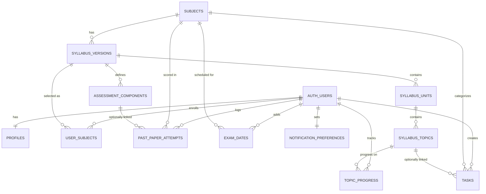

# Lockdin — Database Architecture & Supabase Schema Design Audit

**Status: READ-ONLY AUDIT. Nothing in this document has been executed. No tables created, no migrations run, no files modified, no Supabase project touched.**

---

## Executive Summary

Lockdin is a Cambridge A-Level revision workspace (subjects → syllabus topics → tasks → past papers → dashboard analytics). The **current codebase does not use Supabase at all** — it runs a hand-rolled Express API (`artifacts/api-server`) backed by Drizzle ORM + `pg` against a generic `DATABASE_URL` Postgres instance, with a `localStorage`-based fake authentication layer (`use-auth.ts`) that has no relationship to any real user table. There is **no multi-tenancy** in the current schema — no table has a `user_id` column. It behaves like a single-player local prototype, not a production multi-user app.

The recommended path is: keep Postgres/Drizzle-shaped thinking about relationships, but re-home everything into Supabase Postgres, introduce `auth.users`-linked ownership on every currently-unscoped table, split "shared Cambridge reference data" from "user-owned data," and defer AI/Calendar/notification-history tables until they're actually needed.

---

## Current Project Data Architecture

Evidence from the repo:

- **ORM/driver**: `lib/db/src/index.ts` — `drizzle(pool, { schema })` using `drizzle-orm/node-postgres` and `pg.Pool`, keyed off `process.env.DATABASE_URL`. This is vanilla Postgres, not Supabase's client libraries.
- **Schema** (`lib/db/src/schema/*`): `subjects`, `syllabusUnits`, `syllabusTopics`, `tasks`, `pastPapers`, `examDates`. Every table uses `serial` integer PKs. **None have a `user_id` / owner column.** The app currently assumes exactly one implicit "student."
- **API layer**: `artifacts/api-server` — a plain Express app (`express-app.ts`, `routes/*.ts`) that queries Drizzle directly and returns Zod-validated JSON (`@workspace/api-zod`). No auth middleware, no session/JWT checks anywhere in the routes I can see.
- **Frontend data access**: `lib/api-client-react` — an Orval-generated React Query client hitting `/api/*` on the same Express server. Not calling Supabase directly.
- **"Auth"**: `artifacts/revision-platform/src/hooks/use-auth.ts` stores a fake user object (`name`, `email`, `level`, `examSession`) in `localStorage` under `lockdin_user` / `lockdin_auth` / `onboarded`. It never touches the database. Login/signup forms in `login.tsx` / `signup.tsx` accept literally any credentials and just call `login({...})` locally.
- **Client-side "extra" state** that never reaches the DB: `dashboard-gamification.ts` (XP, streaks, achievements — computed and cached in `localStorage`), `use-notification-prefs.ts` (`localStorage`), `theme-provider.tsx` (`localStorage`).
- **Mock/derived values**: dashboard XP, levels, "predicted grade," "momentum," achievements are all computed client-side from real DB fields (`studyStreakDays`, `syllabusProgress`, paper scores) — these are presentation logic, not persisted domain data. Good instinct already baked into the prototype: e.g. `syllabusProgress` is computed server-side in `routes/subjects.ts` and `routes/dashboard.ts` from topic counts rather than stored.

**Takeaway**: the prototype's *domain shape* (subjects → units → topics; tasks optionally linked to a topic; past papers scored against total marks; exam dates) is a solid, usable blueprint for the real schema. Its *infrastructure* (no Supabase, no real auth, no multi-tenancy, single global dataset) is not, and needs to be rebuilt.

---

## Current Supabase Connection Status

**Category A — Supabase is not connected at all.**

Checked for and did **not** find, anywhere in the repo:
- `@supabase/supabase-js` in any `package.json` (root, `api-server`, `revision-platform`, `mockup-sandbox`, `db`, `api-client-react`, `api-zod`)
- A Supabase client init file
- `NEXT_PUBLIC_SUPABASE_URL` / `SUPABASE_ANON_KEY` / any Supabase env var pattern
- A `supabase/` directory, `supabase/config.toml`, or `supabase/migrations/`
- Supabase Auth calls (`supabase.auth.*`)
- Supabase Storage or Edge Function usage
- Generated Supabase TypeScript types

What *does* exist is a generic `DATABASE_URL`-driven Postgres setup (`lib/db/drizzle.config.ts`, `lib/db/package.json` → `drizzle-kit push`). **No credentials of any kind are present in the repo** — `.gitignore` and `.env*` are properly excluded, so there's nothing to flag as leaked secrets. Good hygiene there.

Since a Supabase project has reportedly already been created, the actual DB engine is still Postgres underneath — so nothing here is thrown away, we're just re-plumbing the connection layer, adding Supabase Auth, and adding RLS, which this app currently has zero concept of.

---

## Confirmed Product Data Requirements

Directly evidenced by working, non-mocked API routes and schema:

1. Subjects (name, Cambridge code, color)
2. Syllabus units → syllabus topics (status: not_started/in_progress/completed, notes, ordering)
3. Study tasks (title, subject, optional topic link, deadline, priority, estimated minutes, completed/completedAt)
4. Past paper attempts (subject, paper code, session, score/totalMarks/percentage, date attempted, time taken, notes)
5. Exam dates (subject, paper code, date, notes)
6. Dashboard aggregation (today's tasks, streak, subject progress %, recent performance, upcoming exams) — all **derived**, none need new storage
7. Progress analytics (syllabus completion %, weekly tasks completed, subjects needing attention, totals) — also **derived**

## Inferred Requirements

Strongly implied by the UI/UX but not yet backed by real persistence:

1. **Real user accounts** (the entire product is single-player right now; multi-tenancy is an obvious, unavoidable requirement once real auth ships)
2. **Per-user ownership** of every table above (tasks, past papers, exam dates, topic progress, subject selection)
3. **Shared Cambridge reference data** for subjects/syllabi so students don't hand-type syllabus topics — `SUBJECT_CATALOG` in `subject-catalog.ts` and the onboarding flow (`onboarding.tsx` seeds one starter task per subject) strongly imply a shared catalog students *select from*, not author from scratch
4. **Syllabus versioning** — implied by "Cambridge 9709," specific paper codes like `9709/12`, and sessions like "May/June 2023" — real Cambridge syllabi do change between versions/years
5. **Notification preferences** (`use-notification-prefs.ts` already models this shape client-side: `morningSummary`, `deadlineReminders`, `examAlerts`) — worth persisting once real accounts exist, so prefs survive across devices
6. **Component/paper-code structure** — `getSubjectPerformance` parses `paperCode.split("/")` to infer "Paper 1" vs "Paper 2" — an ad hoc string-splitting hack that strongly implies a real `components` reference table should exist instead

## Future Requirements (explicitly not MVP)

1. Google Calendar integration (UI already shows a disabled "Coming soon" badge in `settings.tsx`)
2. AI-generated recommendations/insights beyond the current rule-based `insight` string in `subjects.ts` (`"...is improving..."` is plain conditional logic, not AI)
3. Notification **delivery history** (vs. just preferences)
4. Multiple exam boards / IGCSE / teacher accounts / social features — no evidence anywhere in the codebase
5. Gamification (XP/levels/achievements) as *persisted* server data — currently 100% client-computed from real fields plus `localStorage` bookkeeping (`dashboard-gamification.ts`); fine to leave client-side for MVP

## Do Not Build Yet

- AI conversation/embedding/vector tables — zero evidence of any AI feature beyond a static string template
- Notification delivery-log tables — no send mechanism exists yet (client-side `Notification` API + toast only)
- OAuth/Calendar token storage — no OAuth flow exists
- Admin dashboard tables — reference data can be seeded via migrations for now

---

## Data Domain Map

**User-owned** (needs `user_id` FK to `auth.users`, RLS "own rows only"):
`user_subjects` (enrollment), `topic_progress`, `tasks`, `past_paper_attempts`, `exam_dates` (if user-created — see below), `notification_preferences`, `profiles`

**Shared reference data** (readable by all authenticated users, writable only by admins/migrations):
`subjects` (or `syllabi`), `syllabus_versions`, `syllabus_units`, `syllabus_topics`, `assessment_components`, `paper_definitions` (optional)

**Derived / computed, never stored as source-of-truth**:
syllabus completion %, streak, weekly activity counts, average/best paper score, "needs attention" flags, predicted grade, XP/levels — all should stay query-time calculations (views or app-level), exactly as the current API already does it for most of these. Don't regress that good behavior when porting to Supabase.

**Integration data** (future only): Calendar OAuth metadata — do not build now, and when built, tokens must live server-side (Edge Function / server env), never in a client-readable table.

---

## Recommended MVP Tables

| Table | Purpose | Requirement level | Ownership | Importance |
|---|---|---|---|---|
| `profiles` | App-specific user profile, 1:1 with `auth.users` | Inferred (needed once real auth ships) | User-owned | Critical |
| `subjects` | Cambridge subject catalog (name, code, color) | Confirmed | Shared | Critical |
| `syllabus_versions` | A subject's syllabus for a given exam-year range | Inferred | Shared | Critical |
| `syllabus_units` | Units within a syllabus version | Confirmed | Shared | Critical |
| `syllabus_topics` | Topics within a unit | Confirmed | Shared | Critical |
| `assessment_components` | Paper/component definitions (e.g. "Paper 1 – Pure Mathematics") | Inferred | Shared | Important |
| `user_subjects` | Which syllabus version a user is enrolled in | Inferred | User-owned | Critical |
| `topic_progress` | Per-user status on a syllabus topic | Confirmed (shape) | User-owned | Critical |
| `tasks` | Study tasks/deadlines | Confirmed | User-owned | Critical |
| `past_paper_attempts` | Logged paper attempts + scores | Confirmed | User-owned | Critical |
| `exam_dates` | Upcoming exam dates | Confirmed | User-owned | Important |
| `notification_preferences` | Per-user reminder toggles | Inferred | User-owned | Optional (nice for MVP) |

That's 12 tables. Deliberately **not** creating: `dashboard_statistics`, `analytics`, `achievements`, `ai_*`, `calendar_*`, `notification_history` — all either derivable or premature.

---

## Detailed Table Specifications

### `profiles`
1:1 extension of `auth.users` for app-specific fields.

| Column | Type | Nullable | Default | FK | Purpose |
|---|---|---|---|---|---|
| `id` | `uuid` | No | — | `auth.users(id)` on delete cascade | Same ID as auth user |
| `full_name` | `text` | Yes | — | — | Display name |
| `level` | `text` | Yes | — | — | "AS Level (Year 12)" etc. |
| `exam_session` | `text` | Yes | — | — | "May/June 2026" |
| `created_at` | `timestamptz` | No | `now()` | — | — |
| `updated_at` | `timestamptz` | No | `now()` | — | trigger-maintained |

Do NOT duplicate `email` here — read it from `auth.users` via a join or `auth.email()` in RLS policies; storing it invites drift.

### `subjects` (shared reference)
| Column | Type | Nullable | Default | FK | Purpose |
|---|---|---|---|---|---|
| `id` | `uuid` | No | `gen_random_uuid()` | — | — |
| `code` | `text` | No | — | — | e.g. `9709`, unique |
| `name` | `text` | No | — | — | "Mathematics" |
| `color` | `text` | No | — | — | hex accent |
| `created_at` | `timestamptz` | No | `now()` | — | — |

### `syllabus_versions` (shared reference)
| Column | Type | Nullable | Default | FK | Purpose |
|---|---|---|---|---|---|
| `id` | `uuid` | No | `gen_random_uuid()` | — | — |
| `subject_id` | `uuid` | No | — | `subjects(id)` restrict | — |
| `valid_from_session` | `text` | No | — | — | e.g. "2025" |
| `valid_to_session` | `text` | Yes | — | — | null = current |
| `is_current` | `boolean` | No | `true` | — | fast lookup of active version |

Unique: `(subject_id, valid_from_session)`.

### `syllabus_units` / `syllabus_topics` (shared reference)
Mirrors current Drizzle shape almost 1:1, just re-pointed at `syllabus_version_id` instead of `subject_id` directly, so historical syllabi don't get silently rewritten:

`syllabus_units`: `id uuid`, `syllabus_version_id uuid → syllabus_versions`, `title text`, `order_index int`
`syllabus_topics`: `id uuid`, `unit_id uuid → syllabus_units`, `title text`, `order_index int`

### `assessment_components` (shared reference)
| Column | Type | FK | Purpose |
|---|---|---|---|
| `id` | `uuid` | — | — |
| `syllabus_version_id` | `uuid` | `syllabus_versions(id)` | — |
| `code` | `text` | — | "12", "21" (component suffix) |
| `name` | `text` | — | "Paper 1 – Pure Mathematics" |
| `max_marks` | `int` | — | for validation |

Replaces the current `paperCode.split("/")` string-hack in `subjects.ts`.

### `user_subjects`
| Column | Type | Nullable | FK | Purpose |
|---|---|---|---|---|
| `id` | `uuid` | No | — | — |
| `user_id` | `uuid` | No | `auth.users(id)` cascade | — |
| `syllabus_version_id` | `uuid` | No | `syllabus_versions(id)` restrict | — |
| `status` | `text` check in `('active','archived')` | No default `active` | — | soft-remove instead of hard delete |
| `created_at` | `timestamptz` | No | — | — |

Unique: `(user_id, syllabus_version_id)`.

### `topic_progress`
| Column | Type | FK | Purpose |
|---|---|---|---|
| `id` | `uuid` | — | — |
| `user_id` | `uuid` | `auth.users(id)` cascade | — |
| `topic_id` | `uuid` | `syllabus_topics(id)` restrict | — |
| `status` | `text` check `('not_started','in_progress','completed')` default `not_started` | — | — |
| `notes` | `text` | — | — |
| `completed_at` | `timestamptz` | — | set when status → completed |

Unique `(user_id, topic_id)`. Rows created lazily on first interaction — **absence of a row = not_started**, matching current UI behavior (`getStatusIcon` default case). Don't pre-populate a row per topic per user; that's needless write amplification.

### `tasks`
Same shape as current Drizzle table, plus `user_id`:
`id uuid`, `user_id uuid → auth.users cascade`, `title text`, `subject_id uuid → subjects restrict`, `topic_id uuid → syllabus_topics set null` (nullable — tasks don't require a topic), `deadline date`, `priority text check ('low','medium','high') default 'medium'`, `estimated_minutes int`, `completed boolean default false`, `completed_at timestamptz`, `created_at timestamptz default now()`.

### `past_paper_attempts`
`id uuid`, `user_id uuid → auth.users cascade`, `subject_id uuid → subjects restrict`, `component_id uuid → assessment_components set null` (nullable — allow logging before component data exists), `session text`, `score numeric`, `total_marks int`, `percentage numeric` **(store it — see Analytics Strategy)**, `date_attempted date`, `time_taken_minutes int`, `notes text`, `created_at timestamptz default now()`.

### `exam_dates`
`id uuid`, `user_id uuid → auth.users cascade`, `subject_id uuid → subjects restrict`, `paper_code text`, `date date`, `notes text`.

### `notification_preferences`
`user_id uuid → auth.users cascade` (PK), `morning_summary boolean default true`, `deadline_reminders boolean default true`, `exam_alerts boolean default false`, `updated_at timestamptz default now()`.

---

## Relationship Map

```
auth.users 1 ──── 1 profiles
auth.users 1 ──── * user_subjects
auth.users 1 ──── * topic_progress
auth.users 1 ──── * tasks
auth.users 1 ──── * past_paper_attempts
auth.users 1 ──── * exam_dates
auth.users 1 ──── 1 notification_preferences

subjects 1 ──── * syllabus_versions
syllabus_versions 1 ──── * syllabus_units
syllabus_units 1 ──── * syllabus_topics
syllabus_versions 1 ──── * assessment_components
syllabus_versions 1 ──── * user_subjects

syllabus_topics 1 ──── * topic_progress
subjects 1 ──── * tasks
syllabus_topics 1 ──── (0|1) * tasks   (optional link)
subjects 1 ──── * past_paper_attempts
assessment_components 1 ──── * past_paper_attempts (optional link)
subjects 1 ──── * exam_dates
```

## ERD



---

## Authentication Model

Supabase Auth owns `auth.users`. Use Google as primary provider, email/password as secondary — both natively supported by Supabase Auth, no custom tables needed for credentials themselves.

- `profiles.id` is both PK and FK to `auth.users.id` — a true 1:1 extension, not a separate identity.
- Create the `profiles` row via a `handle_new_user()` trigger on `auth.users` insert (standard Supabase pattern) rather than trusting the client to create it.
- Everything else hangs off `auth.uid()` inside RLS policies — never trust a client-supplied `user_id` on insert; default it server-side via `auth.uid()` or a `DEFAULT auth.uid()` column default + RLS `WITH CHECK`.
- The current fake `use-auth.ts` (`localStorage`) will be fully replaced by `supabase-js` auth calls; no schema impact beyond what's above.

---

## Syllabus Architecture

`subjects` → `syllabus_versions` → `syllabus_units` → `syllabus_topics`, with `assessment_components` hanging off `syllabus_version_id` too. The version layer is the important addition over the current prototype: it lets a 2028–2030 syllabus exist alongside a 2025–2027 one without overwriting topics that existing users already have progress against. `user_subjects.syllabus_version_id` pins each student to the specific version they're following, so a syllabus update never silently reshapes an in-progress student's topic list.

Only one meaningful alternative here worth naming:

**Option A (recommended):** Explicit `syllabus_versions` table, versions are immutable once published.
**Option B:** Single mutable `syllabus_topics` table with an `effective_year` column per topic.

A wins on integrity — Option B makes "what did this student actually study" ambiguous once a topic is edited in place. A costs one extra join; worth it for Cambridge's real update cadence.

---

## Study Planner Architecture

`tasks` mirrors the current Drizzle table almost exactly, just adding `user_id` and switching `topic_id`'s target to the versioned `syllabus_topics`. Boolean `completed` + `completed_at` timestamp is kept (not a separate status enum) — there's no evidence of a third task state (e.g. "in progress") anywhere in the UI, so don't add complexity the product doesn't use yet.

---

## Past Paper Architecture

Split **definition** (what the paper is) from **attempt** (a student's score on it). The prototype conflates these somewhat — `pastPapers` stores `paperCode` + `session` as free text per attempt rather than pointing at a shared definition. For MVP, keep `component_id` **nullable** on `past_paper_attempts` so students can log a paper before we've seeded every component, but make `assessment_components` available so the current string-parsing hack in `getSubjectPerformance` (`paperCode.split("/")`) can be replaced with a real join.

---

## Analytics Strategy

Kept as query-time computation for nearly everything, matching what the existing Express routes already do well:

- **Computed, not stored**: syllabus completion %, weekly activity chart, "needs attention" list, average/best score, streak days, predicted grade, XP/level/achievements (all client-side already, fine to leave there for MVP).
- **Stored exception**: `past_paper_attempts.percentage`. Technically derivable from `score/total_marks`, but store it anyway — it's cheap, avoids repeated division in every query/sort, and protects historical accuracy if grading rules or rounding ever change (a stored `78%` shouldn't silently recompute to `77%` later).
- Implement the heavier aggregates (weekly activity, subject attention flags, streak) as **Postgres views or `SECURITY INVOKER` functions**, not materialized views, at this scale — a few thousand students with a few hundred rows each doesn't need materialization yet, and views keep RLS honest automatically (`SECURITY INVOKER` respects the caller's RLS, `SECURITY DEFINER` would bypass it — pick `INVOKER` here).

---

## RLS & Authorization Strategy

Every user-owned table: RLS enabled, `auth.uid() = user_id` for all four operations. Every shared-reference table: RLS enabled, `SELECT` open to any authenticated user, all writes denied to the anon/authenticated roles (writes happen via migrations/seed scripts run with elevated privileges, or later via a service-role admin path — not through the public API).

## RLS Policy Matrix

| Table | SELECT | INSERT | UPDATE | DELETE |
|---|---|---|---|---|
| `profiles` | Own row | Via trigger only (not direct client insert) | Own row | Cascade from `auth.users` delete |
| `subjects` | Authenticated read | Deny (migrations/service role only) | Deny | Deny |
| `syllabus_versions` | Authenticated read | Deny | Deny | Deny |
| `syllabus_units` | Authenticated read | Deny | Deny | Deny |
| `syllabus_topics` | Authenticated read | Deny | Deny | Deny |
| `assessment_components` | Authenticated read | Deny | Deny | Deny |
| `user_subjects` | Own rows | Own (`user_id = auth.uid()`) | Own | Own |
| `topic_progress` | Own rows | Own | Own | Own |
| `tasks` | Own rows | Own | Own | Own |
| `past_paper_attempts` | Own rows | Own | Own | Own |
| `exam_dates` | Own rows | Own | Own | Own |
| `notification_preferences` | Own row | Own | Own | Own |

No exceptions needed at MVP scale — no shared/collaborative or teacher-visibility features exist yet.

---

## Constraints & Data Integrity

- `past_paper_attempts`: `CHECK (score >= 0)`, `CHECK (total_marks > 0)`, `CHECK (score <= total_marks)`
- `assessment_components.max_marks`: `CHECK (max_marks > 0)`
- `tasks.priority`, `topic_progress.status`, `user_subjects.status`: `CHECK` constraints (see enum discussion below) rather than raw free-text
- `syllabus_versions`: `CHECK (valid_to_session IS NULL OR valid_to_session >= valid_from_session)`
- Unique: `subjects.code`, `(subject_id, valid_from_session)` on `syllabus_versions`, `(user_id, syllabus_version_id)` on `user_subjects`, `(user_id, topic_id)` on `topic_progress`

## Enums vs Check Constraints

Use **`text` + `CHECK`**, not native Postgres `enum` types, for `priority`, `topic_progress.status`, `user_subjects.status`. Native enums are annoying to alter later (`ALTER TYPE ... ADD VALUE` has transaction restrictions) and Cambridge/product status vocab is exactly the kind of thing that gains a value someday ("skipped," "archived"). A `CHECK` constraint is a one-line migration to change; an enum type alteration is not.

## Unique Constraints

Covered above — the two that matter most for correctness are `(user_id, syllabus_version_id)` (no double-enrolling in the same syllabus) and `(user_id, topic_id)` (no duplicate progress rows).

## Indexing Strategy

| Table | Columns | Query it supports |
|---|---|---|
| `tasks` | `(user_id, deadline)` | "today's tasks" / "upcoming deadlines" |
| `tasks` | `(user_id, completed)` | filter tabs (today/upcoming/completed/all) |
| `topic_progress` | `(user_id, topic_id)` (also the unique constraint) | lookup + upsert on topic tap |
| `past_paper_attempts` | `(user_id, subject_id, date_attempted)` | trend charts, latest-attempt lookups |
| `exam_dates` | `(user_id, date)` | calendar/countdown queries |
| `syllabus_topics` | `(unit_id)` | syllabus rendering |
| `syllabus_units` | `(syllabus_version_id)` | syllabus rendering |
| `user_subjects` | `(user_id)` | "my subjects" list |

Nothing beyond this — no need to index low-cardinality columns like `priority` or `status` at this scale.

## Delete / Cascade Strategy

- `auth.users` deleted → cascade-delete `profiles`, `user_subjects`, `topic_progress`, `tasks`, `past_paper_attempts`, `exam_dates`, `notification_preferences`. Full right-to-erasure by default.
- `subjects` / `syllabus_versions` / `syllabus_units` / `syllabus_topics` deletes: **`RESTRICT`**, not cascade — shared reference data should never be deletable while live user data points at it. Superseding a syllabus version means publishing a new row and flipping `is_current`, not deleting the old one.
- `tasks.topic_id` → `SET NULL` on topic delete (tasks shouldn't vanish if reference data changes)
- `past_paper_attempts.component_id` → `SET NULL` (same reasoning)

---

## Migration Strategy

Use the Supabase CLI's standard `supabase/migrations/` folder, committed to the repo (this replaces the current `drizzle-kit push` workflow in `lib/db/package.json`). Recommended flow for a 3-person team:

1. `supabase db diff` or hand-written SQL → new timestamped file in `supabase/migrations/`
2. PR review of the SQL itself (this is the actual schema review gate)
3. Merge → CI/local `supabase db reset` replays all migrations in order against a clean local DB
4. Never hand-edit the hosted DB through the dashboard for anything that should persist — dashboard edits and migration files drift apart fast with more than one person on a repo

## Local / Dev / Production Environments

Don't overbuild this for 3 people: **local (Supabase CLI + Docker) → single hosted "production" Supabase project.** Add a dedicated staging project only once real users exist and untested migrations become risky to run directly against live data. A branching-per-PR setup (Supabase's preview branches) is a nice future upgrade, not a day-one requirement.

## TypeScript Database Types

Once schema is approved: `supabase gen types typescript` → commit generated types into something like `lib/db-types/`. This replaces/augments the current Drizzle-inferred types (`InsertSubject`, `SyllabusTopic`, etc. in the schema files) and keeps the Orval-generated API client's manually-defined Zod schemas honest against the real DB shape. Not implementing this yet — flagging it as the next concrete step after schema approval.

---

## Data Flow Mapping (core journeys)

**Select subject**: user picks Physics → insert `user_subjects (user_id, syllabus_version_id)` pointing at the current active version → no syllabus data is copied into user-space.

**Mark topic complete**: tap topic → upsert `topic_progress` on `(user_id, topic_id)` conflict → `status` and `completed_at` updated → dashboard % recalculated at query time from the join, not stored.

**Create task**: pick subject (+ optional topic) → insert `tasks` row with `user_id` defaulted server-side from the session.

**Log past paper**: choose subject (+ optional component) → insert `past_paper_attempts` → `percentage` computed and stored at insert time → trend/analytics queries read straight from the attempts table.

---

## Performance & Scale

Realistic scale (thousands of students, hundreds of topics, dozens of tasks/attempts per student) is comfortably inside default Postgres/Supabase capability with the indexes above — no partitioning, sharding, or materialized views needed at MVP. The one thing worth watching: `topic_progress` row count scales with `students × topics_per_syllabus`, which could hit low hundreds-of-thousands of rows across the user base — still trivial for Postgres with the `(user_id, topic_id)` index in place.

## Data Retention & Deletion

- Account deletion → hard cascade-delete everything user-owned (see cascade strategy above). No soft-delete needed for personal data at MVP; simplicity wins and there's no evidence of a "recover my account" requirement.
- Removing a subject → soft delete via `user_subjects.status = 'archived'`, not a hard delete — preserves task/paper history for that subject rather than orphaning or cascading it away.
- Syllabus version becoming obsolete → never deleted, just superseded (`is_current = false` on the old, `true` on the new).
- Deleting a task or past-paper attempt → hard delete is fine; these are low-stakes, user-initiated, reversible-in-spirit actions with no downstream dependents.

---

## MVP vs Future Architecture

**MVP (12 tables, listed above).**

**Future extensions (not built now):** `calendar_connections` (OAuth metadata, tokens server-side only), `notification_deliveries` (send history), any `ai_*` tables (recommendations, embeddings — current "insight" text is rule-based, not AI), teacher/classroom tables, additional exam-board tables (IGCSE, etc.), social/sharing tables. The MVP schema doesn't need to anticipate these structurally beyond "keep clean, well-typed source data" — a future AI feature reads from `topic_progress` + `past_paper_attempts` just fine without any schema changes today.

---

## Schema Complexity Review

Self-check against the 42-question gauntlet: `assessment_components` is the one table I'd flag as arguably premature — it could be deferred and `past_paper_attempts.component_id` simply added later, keeping paper-code as free text for MVP like the current prototype does. I'm keeping it in the recommendation because the string-parsing hack it replaces (`paperCode.split("/")`) is already a code smell in the live codebase, and the table itself is tiny/simple. Everything else earns its place: no two tables here are redundant, no derived value is stored except the one justified exception (`percentage`), and a new developer can read the ERD in under a minute.

---

## Proposed SQL Schema

**PROPOSED — NOT YET APPROVED FOR MIGRATION. Do not run.**

```sql
-- ============ EXTENSIONS ============
create extension if not exists pgcrypto; -- gen_random_uuid()

-- ============ PROFILES ============
create table public.profiles (
  id uuid primary key references auth.users(id) on delete cascade,
  full_name text,
  level text,
  exam_session text,
  created_at timestamptz not null default now(),
  updated_at timestamptz not null default now()
);
alter table public.profiles enable row level security;
create policy "profiles_select_own" on public.profiles for select using (auth.uid() = id);
create policy "profiles_update_own" on public.profiles for update using (auth.uid() = id);

-- ============ SHARED REFERENCE DATA ============
create table public.subjects (
  id uuid primary key default gen_random_uuid(),
  code text not null unique,
  name text not null,
  color text not null,
  created_at timestamptz not null default now()
);

create table public.syllabus_versions (
  id uuid primary key default gen_random_uuid(),
  subject_id uuid not null references public.subjects(id) on delete restrict,
  valid_from_session text not null,
  valid_to_session text,
  is_current boolean not null default true,
  unique (subject_id, valid_from_session),
  check (valid_to_session is null or valid_to_session >= valid_from_session)
);

create table public.syllabus_units (
  id uuid primary key default gen_random_uuid(),
  syllabus_version_id uuid not null references public.syllabus_versions(id) on delete restrict,
  title text not null,
  order_index int not null default 0
);

create table public.syllabus_topics (
  id uuid primary key default gen_random_uuid(),
  unit_id uuid not null references public.syllabus_units(id) on delete restrict,
  title text not null,
  order_index int not null default 0
);

create table public.assessment_components (
  id uuid primary key default gen_random_uuid(),
  syllabus_version_id uuid not null references public.syllabus_versions(id) on delete restrict,
  code text not null,
  name text not null,
  max_marks int check (max_marks > 0),
  unique (syllabus_version_id, code)
);

alter table public.subjects enable row level security;
alter table public.syllabus_versions enable row level security;
alter table public.syllabus_units enable row level security;
alter table public.syllabus_topics enable row level security;
alter table public.assessment_components enable row level security;

create policy "subjects_read" on public.subjects for select using (auth.role() = 'authenticated');
create policy "syllabus_versions_read" on public.syllabus_versions for select using (auth.role() = 'authenticated');
create policy "syllabus_units_read" on public.syllabus_units for select using (auth.role() = 'authenticated');
create policy "syllabus_topics_read" on public.syllabus_topics for select using (auth.role() = 'authenticated');
create policy "assessment_components_read" on public.assessment_components for select using (auth.role() = 'authenticated');
-- No insert/update/delete policies defined for these tables => denied by default under RLS.

-- ============ USER-OWNED DATA ============
create table public.user_subjects (
  id uuid primary key default gen_random_uuid(),
  user_id uuid not null references auth.users(id) on delete cascade,
  syllabus_version_id uuid not null references public.syllabus_versions(id) on delete restrict,
  status text not null default 'active' check (status in ('active','archived')),
  created_at timestamptz not null default now(),
  unique (user_id, syllabus_version_id)
);

create table public.topic_progress (
  id uuid primary key default gen_random_uuid(),
  user_id uuid not null references auth.users(id) on delete cascade,
  topic_id uuid not null references public.syllabus_topics(id) on delete restrict,
  status text not null default 'not_started' check (status in ('not_started','in_progress','completed')),
  notes text,
  completed_at timestamptz,
  unique (user_id, topic_id)
);

create table public.tasks (
  id uuid primary key default gen_random_uuid(),
  user_id uuid not null references auth.users(id) on delete cascade,
  title text not null,
  subject_id uuid not null references public.subjects(id) on delete restrict,
  topic_id uuid references public.syllabus_topics(id) on delete set null,
  deadline date,
  priority text not null default 'medium' check (priority in ('low','medium','high')),
  estimated_minutes int,
  completed boolean not null default false,
  completed_at timestamptz,
  created_at timestamptz not null default now()
);

create table public.past_paper_attempts (
  id uuid primary key default gen_random_uuid(),
  user_id uuid not null references auth.users(id) on delete cascade,
  subject_id uuid not null references public.subjects(id) on delete restrict,
  component_id uuid references public.assessment_components(id) on delete set null,
  session text not null,
  score numeric not null check (score >= 0),
  total_marks int not null check (total_marks > 0),
  percentage numeric not null,
  date_attempted date not null,
  time_taken_minutes int,
  notes text,
  created_at timestamptz not null default now(),
  check (score <= total_marks)
);

create table public.exam_dates (
  id uuid primary key default gen_random_uuid(),
  user_id uuid not null references auth.users(id) on delete cascade,
  subject_id uuid not null references public.subjects(id) on delete restrict,
  paper_code text,
  date date not null,
  notes text
);

create table public.notification_preferences (
  user_id uuid primary key references auth.users(id) on delete cascade,
  morning_summary boolean not null default true,
  deadline_reminders boolean not null default true,
  exam_alerts boolean not null default false,
  updated_at timestamptz not null default now()
);

alter table public.user_subjects enable row level security;
alter table public.topic_progress enable row level security;
alter table public.tasks enable row level security;
alter table public.past_paper_attempts enable row level security;
alter table public.exam_dates enable row level security;
alter table public.notification_preferences enable row level security;

create policy "user_subjects_own" on public.user_subjects for all
  using (auth.uid() = user_id) with check (auth.uid() = user_id);
create policy "topic_progress_own" on public.topic_progress for all
  using (auth.uid() = user_id) with check (auth.uid() = user_id);
create policy "tasks_own" on public.tasks for all
  using (auth.uid() = user_id) with check (auth.uid() = user_id);
create policy "past_paper_attempts_own" on public.past_paper_attempts for all
  using (auth.uid() = user_id) with check (auth.uid() = user_id);
create policy "exam_dates_own" on public.exam_dates for all
  using (auth.uid() = user_id) with check (auth.uid() = user_id);
create policy "notification_preferences_own" on public.notification_preferences for all
  using (auth.uid() = user_id) with check (auth.uid() = user_id);

-- ============ INDEXES ============
create index tasks_user_deadline_idx on public.tasks (user_id, deadline);
create index tasks_user_completed_idx on public.tasks (user_id, completed);
create index past_paper_attempts_user_subject_date_idx
  on public.past_paper_attempts (user_id, subject_id, date_attempted);
create index exam_dates_user_date_idx on public.exam_dates (user_id, date);
create index syllabus_topics_unit_idx on public.syllabus_topics (unit_id);
create index syllabus_units_version_idx on public.syllabus_units (syllabus_version_id);
create index user_subjects_user_idx on public.user_subjects (user_id);

-- ============ updated_at TRIGGER (reusable) ============
create or replace function public.set_updated_at()
returns trigger language plpgsql as $$
begin
  new.updated_at = now();
  return new;
end;
$$;

create trigger profiles_set_updated_at
  before update on public.profiles
  for each row execute function public.set_updated_at();

-- ============ auth.users -> profiles bootstrap ============
create or replace function public.handle_new_user()
returns trigger language plpgsql security definer set search_path = public as $$
begin
  insert into public.profiles (id, full_name)
  values (new.id, new.raw_user_meta_data ->> 'full_name');
  insert into public.notification_preferences (user_id) values (new.id);
  return new;
end;
$$;

create trigger on_auth_user_created
  after insert on auth.users
  for each row execute function public.handle_new_user();
```

---

## Risks & Trade-offs

- **Versioned syllabus adds a join** every syllabus-progress read needs; accepted trade-off for not corrupting historical student progress when Cambridge updates a syllabus.
- **`assessment_components` may be overkill for launch day** if the team wants to ship before seeding real component data — nullable FK mitigates this; `past_paper_attempts` works fine with `component_id = null` and free-text `session`/paper-code entry in the meantime.
- **Storing `percentage`** is a deliberate small denormalization — accepted because recompute-on-read for every dashboard render is wasteful and the value should be immutable history anyway.
- **No soft-delete on tasks/past papers** — accepted for simplicity; revisit only if "undo delete" becomes an actual feature request.

## Open Questions

These genuinely can't be answered from the repo alone:

1. Will Lockdin ever support more than one exam board (e.g. Edexcel, AQA) or is Cambridge the permanent scope? This affects whether `exam_boards` needs to exist as a table now vs. later.
2. Will teachers/parents ever need read access to a student's data? Affects whether RLS needs a "shared with" concept baked in early.
3. Should `topic_progress.notes` support rich text/attachments, or is plain text (as currently in the Drizzle schema) sufficient long-term?

## Recommended Implementation Order

1. Confirm the Supabase project's connection details are safely available to the team (env vars, not committed)
2. Set up `supabase/` CLI structure + local dev DB
3. Migration 1: shared reference schema (`subjects`, `syllabus_versions`, `syllabus_units`, `syllabus_topics`, `assessment_components`) + RLS read policies
4. Migration 2: `profiles` + `handle_new_user()` trigger + Google/email auth providers enabled in Supabase Auth settings
5. Migration 3: `user_subjects`, `topic_progress`
6. Migration 4: `tasks`, `past_paper_attempts`, `exam_dates`, `notification_preferences`
7. Add all RLS policies (can be folded into each migration rather than a separate pass)
8. Add indexes
9. Seed reference data (real Cambridge subjects/syllabus for at least the subjects already in `SUBJECT_CATALOG`)
10. `supabase gen types typescript` → wire into the frontend
11. Swap `use-auth.ts` for real Supabase Auth calls
12. Replace Express/Drizzle API routes with direct Supabase client calls (or keep Express as a thin layer over Supabase if the team wants to preserve the existing Zod validation layer — either works, pick based on team preference)
13. Migrate mock/local data flows one feature at a time (subjects → syllabus → tasks → past papers → exam dates)
14. Test cross-user isolation manually (two test accounts, confirm zero data bleed)
15. Test that `supabase db reset` reproduces the schema cleanly from migrations alone

---

## Final Verdict

The product domain is well understood and the prototype's data shapes are genuinely good starting material — this is not a "throw it out and start over" situation for the *domain model*. But the project is **not yet ready for database implementation** in the infrastructure sense: there's no Supabase connection, no real authentication, and zero multi-tenancy anywhere in the current schema. Before writing a single migration, the team should explicitly confirm: (1) Google + email auth via Supabase Auth is still the plan, (2) the syllabus-versioning approach above is acceptable given it adds a join layer, and (3) whether `assessment_components` ships at launch or gets deferred. Once those three are confirmed, the proposed schema above is ready to become Migration 1.
